<!-- Code generated by protoc-gen-orm. DO NOT EDIT. -->

# `freebusy` — GORM models

Go structs with GORM struct tags — one package per schema.

Generated from Protobuf by protoc-gen-orm. Source of truth is the `.proto` files — regenerate rather than editing.

| Models | Enums |
| ---: | ---: |
| 39 | 19 |

## Entity relationships

```mermaid
erDiagram
    direction LR
    AvailabilityException {
        string id PK
        string property_id FK
        string unit_id FK
        string window_id FK
        string date_range_id FK
    }
    Booking {
        string id PK
        string unit FK
        string customer FK
        string promo_code FK
        string contact_id FK
        string window_id FK
        string price_id FK
        string discount_id FK
        string total_id FK
        string refund_amount_id FK
    }
    BufferSettings {
        string id PK
    }
    CancellationPolicy {
        string id PK
    }
    Channel {
        string id PK
        string property FK
    }
    ChannelSyncStatus {
        string id PK
    }
    Contact {
        string id PK
    }
    DateRange {
        string id PK
    }
    Discount {
        string id PK
        string amount_off_id FK
    }
    Fee {
        string id PK
        string unit_id FK
        string amount_id FK
    }
    LosDiscount {
        string id PK
        string unit_id FK
        string amount_off_id FK
    }
    Media {
        string id PK
        string property_id FK
        string unit_id FK
    }
    Member {
        string id PK
        string user FK
        string inviter FK
        string organisation_id FK
    }
    Money {
        string id PK
    }
    Organisation {
        string id PK
    }
    Policy {
        string id PK
    }
    PostalAddress {
        string id PK
    }
    PriceComponent {
        string id PK
        string booking_id FK
        string amount_id FK
    }
    PromoCode {
        string id PK
        string discount_id FK
        string window_id FK
        string limits_id FK
        string scope_id FK
    }
    Property {
        string id PK
        string organisation FK
        string address_id FK
        string policy_id FK
    }
    PropertyUnits {
        string id PK
        string property_id FK
        string unit_id FK
    }
    RateOverride {
        string id PK
        string unit_id FK
        string date_range_id FK
        string price_id FK
    }
    RecurringRule {
        string id PK
        string schedule_id FK
    }
    Redemption {
        string id PK
        string customer FK
        string booking FK
        string promo_code_id FK
        string amount_applied_id FK
    }
    RedemptionWindow {
        string id PK
    }
    RefundTier {
        string id PK
        string cancellation_policy_id FK
    }
    Schedule {
        string id PK
        string property_id FK
        string buffers_id FK
        string stay_constraints_id FK
        string cancellation_policy_id FK
    }
    ScheduleExceptions {
        string id PK
        string schedule_id FK
        string availability_exception_id FK
    }
    Scope {
        string id PK
        string min_subtotal_id FK
    }
    ScopeApplicableProperties {
        string id PK
        string scope_id FK
        string property_id FK
    }
    ScopeApplicableUnits {
        string id PK
        string scope_id FK
        string unit_id FK
    }
    StayConstraints {
        string id PK
    }
    Tax {
        string id PK
        string unit_id FK
    }
    TimeWindow {
        string id PK
    }
    Unit {
        string id PK
        string property_id FK
        string price_id FK
    }
    UnitApplicablePromoCodes {
        string id PK
        string unit_id FK
        string promo_code_id FK
    }
    UnitMapping {
        string id PK
        string unit FK
        string channel_id FK
    }
    UsageLimits {
        string id PK
    }
    User {
        string id PK
    }
    AvailabilityException }o--|| Property : "property_id"
    AvailabilityException }o--|| Unit : "unit_id"
    AvailabilityException }o--|| TimeWindow : "window_id"
    AvailabilityException }o--|| DateRange : "date_range_id"
    Booking }o--|| Unit : "unit"
    Booking }o--|| User : "customer"
    Booking }o--|| PromoCode : "promo_code"
    Booking }o--|| Contact : "contact_id"
    Booking }o--|| TimeWindow : "window_id"
    Booking }o--|| Money : "price_id"
    Booking }o--|| Money : "discount_id"
    Booking }o--|| Money : "total_id"
    Booking }o--|| Money : "refund_amount_id"
    Channel }o--|| Property : "property"
    Discount }o--|| Money : "amount_off_id"
    Fee }o--|| Unit : "unit_id"
    Fee }o--|| Money : "amount_id"
    LosDiscount }o--|| Unit : "unit_id"
    LosDiscount }o--|| Money : "amount_off_id"
    Media }o--|| Property : "property_id"
    Media }o--|| Unit : "unit_id"
    Member }o--|| User : "user"
    Member }o--|| User : "inviter"
    Member }o--|| Organisation : "organisation_id"
    PriceComponent }o--|| Booking : "booking_id"
    PriceComponent }o--|| Money : "amount_id"
    PromoCode }o--|| Discount : "discount_id"
    PromoCode }o--|| RedemptionWindow : "window_id"
    PromoCode }o--|| UsageLimits : "limits_id"
    PromoCode }o--|| Scope : "scope_id"
    Property }o--|| Organisation : "organisation"
    Property }o--|| PostalAddress : "address_id"
    Property }o--|| Policy : "policy_id"
    PropertyUnits }o--|| Property : "property_id"
    PropertyUnits }o--|| Unit : "unit_id"
    RateOverride }o--|| Unit : "unit_id"
    RateOverride }o--|| DateRange : "date_range_id"
    RateOverride }o--|| Money : "price_id"
    RecurringRule }o--|| Schedule : "schedule_id"
    Redemption }o--|| User : "customer"
    Redemption }o--|| Booking : "booking"
    Redemption }o--|| PromoCode : "promo_code_id"
    Redemption }o--|| Money : "amount_applied_id"
    RefundTier }o--|| CancellationPolicy : "cancellation_policy_id"
    Schedule }o--|| Property : "property_id"
    Schedule }o--|| BufferSettings : "buffers_id"
    Schedule }o--|| StayConstraints : "stay_constraints_id"
    Schedule }o--|| CancellationPolicy : "cancellation_policy_id"
    ScheduleExceptions }o--|| Schedule : "schedule_id"
    ScheduleExceptions }o--|| AvailabilityException : "availability_exception_id"
    Scope }o--|| Money : "min_subtotal_id"
    ScopeApplicableProperties }o--|| Scope : "scope_id"
    ScopeApplicableProperties }o--|| Property : "property_id"
    ScopeApplicableUnits }o--|| Scope : "scope_id"
    ScopeApplicableUnits }o--|| Unit : "unit_id"
    Tax }o--|| Unit : "unit_id"
    Unit }o--|| Property : "property_id"
    Unit }o--|| Money : "price_id"
    UnitApplicablePromoCodes }o--|| Unit : "unit_id"
    UnitApplicablePromoCodes }o--|| PromoCode : "promo_code_id"
    UnitMapping }o--|| Unit : "unit"
    UnitMapping }o--|| Channel : "channel_id"
```

## Output

- `<schema>/models.go` — one Go package per schema, one struct per table.
- `migrate.go` — a factory `Registry` (with a preloaded `Default`) that migrates every model in one call; emitted when the `go_module` opt is set. Call `Default.EnsureSchemas(db)` before `Default.Migrate(db)` so the schema-qualified tables have their Postgres schemas.
- Nullable columns are pointer types; proto enums become string-typed Go enums.
- Attach in main: `Default.EnsureSchemas(db)` then `Default.Migrate(db)`, or wire the structs into a `*gorm.DB` and run AutoMigrate yourself.
- `<schema>/<model>_store.go` — a typed CRUD store per resource (Create, GetByID, List, Count, Update, DeleteByID, plus GetBy/ListBy finders for unique and foreign-key columns); emitted when the `stores` opt is set (which also requires `go_module`). Requires `gorm.io/gorm`.
- `gormx/gormx.go` — the shared runtime every store imports: `ListOptions`, the generic `Store[M]` interface every store satisfies, a `GenericStore[M]` engine that runs CRUD for any model with no per-entity code, and `EnsureSchemas`. Lets one generic engine drive every entity.
- `Registry.Instrument(db)` in `migrate.go` — installs the OpenTelemetry GORM tracing plugin; on by default (set the `otel` opt false to omit), emitted with `go_module`. Requires `gorm.io/plugin/opentelemetry`.

## Schema `booking`

### `Booking` → `resource`

A reservation against a unit. The hold lifecycle lives here as states rather than a separate service: CreateBooking places a PENDING_HOLD, confirmation flips it to CONFIRMED, and an internal sweeper expires holds that are never confirmed.

| Column | Type | Null |
| --- | --- | --- |
| `id` | `CHAR(26)` | not null |
| `name` | `VARCHAR(255)` | not null |
| `unit` | `CHAR(26)` | not null |
| `customer` | `CHAR(26)` | nullable |
| `units` | `INTEGER` | nullable |
| `assigned_unit` | `VARCHAR(255)` | nullable |
| `state` | `BookingState` | nullable |
| `hold_expire_time` | `TIMESTAMPTZ` | nullable |
| `promo_code` | `CHAR(26)` | nullable |
| `notes` | `VARCHAR(255)` | nullable |
| `attributes` | `JSONB` | nullable |
| `cancel_reason` | `CancelReason` | nullable |
| `create_time` | `TIMESTAMPTZ` | not null |
| `update_time` | `TIMESTAMPTZ` | not null |
| `confirm_time` | `TIMESTAMPTZ` | nullable |
| `cancel_time` | `TIMESTAMPTZ` | nullable |
| `refund_percent` | `INTEGER` | nullable |
| `hold_ttl` | `INTERVAL` | nullable |
| `etag` | `VARCHAR(255)` | nullable |
| `contact_id` | `CHAR(26)` | nullable |
| `window_id` | `CHAR(26)` | not null |
| `price_id` | `CHAR(26)` | nullable |
| `discount_id` | `CHAR(26)` | nullable |
| `total_id` | `CHAR(26)` | nullable |
| `refund_amount_id` | `CHAR(26)` | nullable |

### Enums

- `BookingState`: PENDING_HOLD, CONFIRMED, CANCELLED, EXPIRED, COMPLETED, NO_SHOW
- `CancelReason`: REQUESTED_BY_CUSTOMER, REQUESTED_BY_OPERATOR, PAYMENT_FAILED, NO_SHOW, OTHER

## Schema `channel`

### `Channel` → `resource`

A connection between one property and one distribution channel (OTA/GDS). It is the anchor for 2-way ARI: availability/rates/inventory are pushed out per mapped unit, and reservations made on the channel are pulled in as bookings. Credentials are never carried in the API — only an opaque handle to where they are stored.

| Column | Type | Null |
| --- | --- | --- |
| `id` | `CHAR(26)` | not null |
| `name` | `VARCHAR(255)` | not null |
| `property` | `CHAR(26)` | not null |
| `type` | `ChannelType` | not null |
| `display_name` | `VARCHAR(255)` | nullable |
| `external_property_id` | `VARCHAR(255)` | nullable |
| `credential_ref` | `VARCHAR(255)` | nullable |
| `state` | `ChannelState` | nullable |
| `last_sync_time` | `TIMESTAMPTZ` | nullable |
| `create_time` | `TIMESTAMPTZ` | not null |
| `update_time` | `TIMESTAMPTZ` | not null |
| `etag` | `VARCHAR(255)` | nullable |

### `UnitMapping` → `unit_mappings`

Maps a freebusy Unit to its counterpart on the channel. ARI for a unit only flows once a MAPPED mapping exists: the external room-type and rate-plan ids key the availability/rate/restriction push and resolve inbound reservations back to the right unit.

| Column | Type | Null |
| --- | --- | --- |
| `id` | `CHAR(26)` | not null |
| `name` | `VARCHAR(255)` | not null |
| `unit` | `CHAR(26)` | not null |
| `external_room_type_id` | `VARCHAR(255)` | not null |
| `external_rate_plan_id` | `VARCHAR(255)` | nullable |
| `state` | `MappingState` | nullable |
| `create_time` | `TIMESTAMPTZ` | not null |
| `update_time` | `TIMESTAMPTZ` | not null |
| `etag` | `VARCHAR(255)` | nullable |
| `channel_id` | `CHAR(26)` | not null |

### `ChannelSyncStatus` → `sync_statuses`

A rollup of a channel's sync health, modeled as a singleton sub-resource of the channel (one per channel) and read via GetChannelSyncStatus.

| Column | Type | Null |
| --- | --- | --- |
| `id` | `CHAR(26)` | not null |
| `name` | `VARCHAR(255)` | not null |
| `state` | `ChannelState` | nullable |
| `last_sync_time` | `TIMESTAMPTZ` | nullable |
| `pending_count` | `INTEGER` | nullable |
| `failed_count` | `INTEGER` | nullable |
| `last_error` | `VARCHAR(255)` | nullable |

### Enums

- `ChannelType`: AGODA, BOOKING_COM, EXPEDIA, AIRBNB, MAKEMYTRIP, GOIBIBO, GDS, DIRECT
- `ChannelState`: CONNECTED, DISABLED, ERROR
- `MappingState`: MAPPED, UNMAPPED

## Schema `identity`

### `User` → `users`

A signed-in person. Identity is deliberately thin: actual login is an OIDC redirect flow handled over plain HTTP by the IdP, so most of "auth" never appears as an RPC. Email and identity come from the IdP and are read-only here; only profile preferences are editable.

| Column | Type | Null |
| --- | --- | --- |
| `id` | `CHAR(26)` | not null |
| `name` | `VARCHAR(255)` | not null |
| `email` | `VARCHAR(255)` | nullable |
| `display_name` | `VARCHAR(255)` | nullable |
| `avatar_url` | `VARCHAR(255)` | nullable |
| `locale` | `VARCHAR(255)` | nullable |
| `time_zone` | `VARCHAR(255)` | nullable |
| `create_time` | `TIMESTAMPTZ` | not null |
| `update_time` | `TIMESTAMPTZ` | not null |
| `etag` | `VARCHAR(255)` | nullable |

## Schema `organisation`

### `Organisation` → `resource`

A chain: the hotel brand/company that owns one or more properties, and the unit of multi-tenancy. The shell enforces isolation with row-level security keyed off the caller's organisation. Each Property references the Organisation it belongs to; members here are the chain's administrators, not its guests (guests relate to a property only through bookings).

| Column | Type | Null |
| --- | --- | --- |
| `id` | `CHAR(26)` | not null |
| `name` | `VARCHAR(255)` | not null |
| `display_name` | `VARCHAR(255)` | not null |
| `slug` | `VARCHAR(255)` | nullable |
| `billing_email` | `VARCHAR(255)` | nullable |
| `state` | `OrganisationState` | nullable |
| `settings` | `JSONB` | nullable |
| `member_count` | `BIGINT` | nullable |
| `create_time` | `TIMESTAMPTZ` | not null |
| `update_time` | `TIMESTAMPTZ` | not null |
| `etag` | `VARCHAR(255)` | nullable |

### `Member` → `members`

The membership of a user in an organisation, with their role.

| Column | Type | Null |
| --- | --- | --- |
| `id` | `CHAR(26)` | not null |
| `name` | `VARCHAR(255)` | not null |
| `user` | `CHAR(26)` | nullable |
| `email` | `VARCHAR(255)` | not null |
| `display_name` | `VARCHAR(255)` | nullable |
| `role` | `OrganisationRole` | not null |
| `state` | `MemberState` | nullable |
| `inviter` | `CHAR(26)` | nullable |
| `create_time` | `TIMESTAMPTZ` | not null |
| `update_time` | `TIMESTAMPTZ` | not null |
| `etag` | `VARCHAR(255)` | nullable |
| `organisation_id` | `CHAR(26)` | not null |

### Enums

- `OrganisationState`: ACTIVE, SUSPENDED
- `OrganisationRole`: OWNER, ADMIN, MEMBER, VIEWER
- `MemberState`: INVITED, ACTIVE, SUSPENDED

## Schema `promocode`

### `PromoCode` → `resource`

A redeemable discount applied to a booking's subtotal. Scoped by a redemption window, usage caps, a minimum subtotal, and an optional set of resources / offerings it applies to.

| Column | Type | Null |
| --- | --- | --- |
| `id` | `CHAR(26)` | not null |
| `name` | `VARCHAR(255)` | not null |
| `code` | `VARCHAR(255)` | not null |
| `display_name` | `VARCHAR(255)` | nullable |
| `description` | `TEXT` | nullable |
| `redemption_count` | `BIGINT` | nullable |
| `state` | `PromoCodeState` | nullable |
| `disabled` | `BOOLEAN` | nullable |
| `create_time` | `TIMESTAMPTZ` | not null |
| `update_time` | `TIMESTAMPTZ` | not null |
| `etag` | `VARCHAR(255)` | nullable |
| `discount_id` | `CHAR(26)` | not null |
| `window_id` | `CHAR(26)` | nullable |
| `limits_id` | `CHAR(26)` | nullable |
| `scope_id` | `CHAR(26)` | nullable |

### `Redemption` → `redemptions`

Redemption is a single use of a promo code, modeled as a sub-resource of PromoCode rather than an inline list — so it has its own name/lifecycle and is listed with paging (ListRedemptions). The {promo_code} parent segment generates the promo_code_id FK back to the owning code (1:n into promocode.redemptions); amount_applied is the shared google.type.Money in common.moneys. Redemptions are created during CreateBooking, never directly.

| Column | Type | Null |
| --- | --- | --- |
| `id` | `CHAR(26)` | not null |
| `name` | `VARCHAR(255)` | not null |
| `customer` | `CHAR(26)` | not null |
| `booking` | `CHAR(26)` | not null |
| `redeemed_time` | `TIMESTAMPTZ` | nullable |
| `promo_code_id` | `CHAR(26)` | not null |
| `amount_applied_id` | `CHAR(26)` | nullable |

### `Discount` → `discounts`

Discount describes how a promo code reduces a subtotal. Nested value object → belongs-to child table promocode.discounts (FK discount_id on promo_codes). Exactly one of percent_off / amount_off is set; the oneof case is the discriminator, so no separate type enum is needed.

| Column | Type | Null |
| --- | --- | --- |
| `id` | `CHAR(26)` | not null |
| `percent_off` | `INTEGER` | nullable |
| `amount_case` | `DiscountAmountCase` | nullable |
| `amount_off_id` | `CHAR(26)` | nullable |

### `RedemptionWindow` → `redemption_windows`

RedemptionWindow bounds when a code can be redeemed; an unset bound is open-ended. Nested value object → belongs-to promocode.redemption_windows.

| Column | Type | Null |
| --- | --- | --- |
| `id` | `CHAR(26)` | not null |
| `start_time` | `TIMESTAMPTZ` | nullable |
| `end_time` | `TIMESTAMPTZ` | nullable |

### `UsageLimits` → `usage_limits`

UsageLimits caps how often a code can be redeemed. Nested value object → belongs-to promocode.usage_limits. The caps are wrapper types so "unset" (unlimited) is distinct from an explicit value, including 0.

| Column | Type | Null |
| --- | --- | --- |
| `id` | `CHAR(26)` | not null |
| `max_redemptions` | `BIGINT` | nullable |
| `per_customer_limit` | `INTEGER` | nullable |

### `Scope` → `scopes`

Scope restricts which bookings a code applies to. Nested value object → belongs-to promocode.scopes. Its repeated resource references and Money normalize one level deeper (array columns / common.moneys).

| Column | Type | Null |
| --- | --- | --- |
| `id` | `CHAR(26)` | not null |
| `min_subtotal_id` | `CHAR(26)` | nullable |

### `ScopeApplicableProperties` → `scope_applicable_properties`

Join table for the many-to-many relation Scope.applicable_properties ↔ Property.

| Column | Type | Null |
| --- | --- | --- |
| `id` | `CHAR(26)` | not null |
| `scope_id` | `CHAR(26)` | not null |
| `property_id` | `CHAR(26)` | not null |

### `ScopeApplicableUnits` → `scope_applicable_units`

Join table for the many-to-many relation Scope.applicable_units ↔ Unit.

| Column | Type | Null |
| --- | --- | --- |
| `id` | `CHAR(26)` | not null |
| `scope_id` | `CHAR(26)` | not null |
| `unit_id` | `CHAR(26)` | not null |
| `unit_name` | `TEXT` | not null |

### Enums

- `PromoCodeState`: ACTIVE, DISABLED, EXPIRED
- `DiscountAmountCase`: PERCENT_OFF, AMOUNT_OFF

## Schema `property`

### `Property` → `properties`

A hotel (or other lodging property): the guest-facing venue a chain operates. A Property belongs to an Organisation (the chain/brand) and carries the showcase media, address, and informational policies shown to guests. Its bookable inventory lives in child Units (room types); pricing and availability are modeled there, not here.

| Column | Type | Null |
| --- | --- | --- |
| `id` | `CHAR(26)` | not null |
| `name` | `VARCHAR(255)` | not null |
| `organisation` | `CHAR(26)` | not null |
| `display_name` | `VARCHAR(255)` | not null |
| `description` | `VARCHAR(255)` | nullable |
| `time_zone` | `VARCHAR(255)` | not null |
| `tags` | `VARCHAR(255)[]` | nullable |
| `attributes` | `JSONB` | nullable |
| `state` | `PropertyState` | nullable |
| `create_time` | `TIMESTAMPTZ` | not null |
| `update_time` | `TIMESTAMPTZ` | not null |
| `etag` | `VARCHAR(255)` | nullable |
| `address_id` | `CHAR(26)` | nullable |
| `policy_id` | `CHAR(26)` | nullable |

### `Unit` → `units`

A bookable unit type within a property: a pool of `capacity` interchangeable rooms/units of the same kind (e.g. "Deluxe King", capacity 12). A Unit carries its own pricing, media, occupancy limit, and the promo codes advertised for it. The freebusy engine computes how many units are free for a window; its booking_mode decides whether availability is time slots or per-night counts.

| Column | Type | Null |
| --- | --- | --- |
| `id` | `CHAR(26)` | not null |
| `name` | `VARCHAR(255)` | not null |
| `display_name` | `VARCHAR(255)` | not null |
| `description` | `VARCHAR(255)` | nullable |
| `type` | `UnitType` | not null |
| `booking_mode` | `BookingMode` | not null |
| `capacity` | `INTEGER` | nullable |
| `max_occupancy` | `INTEGER` | nullable |
| `time_zone` | `VARCHAR(255)` | not null |
| `pricing_unit` | `PricingUnit` | nullable |
| `duration` | `INTERVAL` | nullable |
| `tags` | `VARCHAR(255)[]` | nullable |
| `attributes` | `JSONB` | nullable |
| `state` | `UnitState` | nullable |
| `create_time` | `TIMESTAMPTZ` | not null |
| `update_time` | `TIMESTAMPTZ` | not null |
| `etag` | `VARCHAR(255)` | nullable |
| `property_id` | `CHAR(26)` | not null |
| `price_id` | `CHAR(26)` | nullable |

### `Policy` → `policies`

Guest-facing, informational property policy: what to *display* to a guest (check-in/out hours, house rules). The enforced refund/stay rules that gate bookability live on each Unit's Schedule (freebusy.schedule.v1), not here, so there is a single source of truth for enforcement.

| Column | Type | Null |
| --- | --- | --- |
| `id` | `CHAR(26)` | not null |
| `checkin_time` | `TIME` | nullable |
| `checkout_time` | `TIME` | nullable |
| `house_rules` | `VARCHAR(255)[]` | nullable |
| `notes` | `VARCHAR(255)` | nullable |

### `RateOverride` → `rate_overrides`

A price override for a span of dates and/or specific weekdays, layered over a unit's base `price`. The price is still interpreted per the unit's pricing_unit (per night, per booking, per person).

| Column | Type | Null |
| --- | --- | --- |
| `id` | `CHAR(26)` | not null |
| `weekdays` | `` | nullable |
| `unit_id` | `CHAR(26)` | not null |
| `date_range_id` | `CHAR(26)` | nullable |
| `price_id` | `CHAR(26)` | not null |

### `LosDiscount` → `los_discounts`

A discount applied to a NIGHTLY subtotal once the stay reaches a minimum length. Exactly one of percent_off or amount_off is set.

| Column | Type | Null |
| --- | --- | --- |
| `id` | `CHAR(26)` | not null |
| `min_nights` | `INTEGER` | not null |
| `percent_off` | `INTEGER` | nullable |
| `unit_id` | `CHAR(26)` | not null |
| `amount_off_id` | `CHAR(26)` | nullable |

### `Fee` → `fees`

A fee added on top of a unit's base subtotal. Exactly one of `amount` or `percent` is set. Surfaces as a TYPE_FEE line in a booking's price_components.

| Column | Type | Null |
| --- | --- | --- |
| `id` | `CHAR(26)` | not null |
| `code` | `VARCHAR(255)` | not null |
| `display_name` | `VARCHAR(255)` | nullable |
| `percent` | `INTEGER` | nullable |
| `pricing_unit` | `PricingUnit` | nullable |
| `taxable` | `BOOLEAN` | nullable |
| `unit_id` | `CHAR(26)` | not null |
| `amount_id` | `CHAR(26)` | nullable |

### `Tax` → `taxes`

A tax applied to the taxable base (base subtotal plus taxable fees). Surfaces as a TYPE_TAX line in a booking's price_components.

| Column | Type | Null |
| --- | --- | --- |
| `id` | `CHAR(26)` | not null |
| `code` | `VARCHAR(255)` | not null |
| `display_name` | `VARCHAR(255)` | nullable |
| `percent` | `DOUBLE PRECISION` | not null |
| `unit_id` | `CHAR(26)` | not null |

### `PropertyUnits` → `units_link`

Join table for the many-to-many relation Property.units ↔ Unit.

| Column | Type | Null |
| --- | --- | --- |
| `id` | `CHAR(26)` | not null |
| `property_id` | `CHAR(26)` | not null |
| `unit_id` | `CHAR(26)` | not null |
| `unit_name` | `TEXT` | not null |

### `UnitApplicablePromoCodes` → `unit_applicable_promo_codes`

Join table for the many-to-many relation Unit.applicable_promo_codes ↔ PromoCode.

| Column | Type | Null |
| --- | --- | --- |
| `id` | `CHAR(26)` | not null |
| `unit_id` | `CHAR(26)` | not null |
| `promo_code_id` | `CHAR(26)` | not null |

### Enums

- `PropertyState`: ACTIVE, ARCHIVED
- `UnitType`: PROVIDER, ROOM, EQUIPMENT, LODGING, SPACE
- `BookingMode`: TIME_SLOT, NIGHTLY
- `PricingUnit`: PER_BOOKING, PER_NIGHT, PER_PERSON
- `UnitState`: ACTIVE, ARCHIVED

## Schema `schedule`

### `AvailabilityException` → `availability_exceptions`

An override of a unit's normal hours on a specific span: a blackout / holiday closure, or extra hours beyond the recurring rules.

| Column | Type | Null |
| --- | --- | --- |
| `id` | `CHAR(26)` | not null |
| `name` | `VARCHAR(255)` | not null |
| `kind` | `ExceptionKind` | not null |
| `reason` | `VARCHAR(255)` | nullable |
| `create_time` | `TIMESTAMPTZ` | not null |
| `span_case` | `AvailabilityExceptionSpanCase` | nullable |
| `property_id` | `CHAR(26)` | not null |
| `unit_id` | `CHAR(26)` | not null |
| `window_id` | `CHAR(26)` | nullable |
| `date_range_id` | `CHAR(26)` | nullable |

### `Schedule` → `resource`

Aggregate read view of a unit's availability configuration: the inputs the freebusy engine consumes. Modeled as a singleton resource, one per unit.

| Column | Type | Null |
| --- | --- | --- |
| `id` | `CHAR(26)` | not null |
| `name` | `VARCHAR(255)` | not null |
| `etag` | `VARCHAR(255)` | nullable |
| `property_id` | `CHAR(26)` | not null |
| `buffers_id` | `CHAR(26)` | nullable |
| `stay_constraints_id` | `CHAR(26)` | nullable |
| `cancellation_policy_id` | `CHAR(26)` | nullable |

### `RecurringRule` → `recurring_rules`

A recurring availability window expressed as an RRULE plus a daily open span. The freebusy engine expands these against the unit's timezone.

| Column | Type | Null |
| --- | --- | --- |
| `id` | `CHAR(26)` | not null |
| `rrule` | `VARCHAR(255)` | not null |
| `opens` | `VARCHAR(255)` | nullable |
| `closes` | `VARCHAR(255)` | nullable |
| `schedule_id` | `CHAR(26)` | not null |

### `BufferSettings` → `buffer_settings`

Buffer and notice settings applied around bookings.

| Column | Type | Null |
| --- | --- | --- |
| `id` | `CHAR(26)` | not null |
| `start_delta` | `INTERVAL` | nullable |
| `end_delta` | `INTERVAL` | nullable |
| `min_notice` | `INTERVAL` | nullable |
| `max_advance` | `INTERVAL` | nullable |
| `gap` | `INTERVAL` | nullable |

### `StayConstraints` → `stay_constraints`

Stay rules that affect bookability for NIGHTLY units.

| Column | Type | Null |
| --- | --- | --- |
| `id` | `CHAR(26)` | not null |
| `min_nights` | `INTEGER` | nullable |
| `max_nights` | `INTEGER` | nullable |
| `checkin_weekdays` | `` | nullable |
| `checkout_weekdays` | `` | nullable |
| `advance_min_days` | `INTEGER` | nullable |
| `advance_max_days` | `INTEGER` | nullable |

### `CancellationPolicy` → `cancellation_policies`

Refund rules graded by how far ahead of a booking's start it is cancelled.

| Column | Type | Null |
| --- | --- | --- |
| `id` | `CHAR(26)` | not null |

### `RefundTier` → `refund_tiers`

One tier of a CancellationPolicy: cancel at least `cutoff` before the booking start to receive `refund_percent` of the total back.

| Column | Type | Null |
| --- | --- | --- |
| `id` | `CHAR(26)` | not null |
| `cutoff` | `INTERVAL` | not null |
| `refund_percent` | `INTEGER` | not null |
| `cancellation_policy_id` | `CHAR(26)` | not null |

### `ScheduleExceptions` → `exceptions`

Join table for the many-to-many relation Schedule.exceptions ↔ AvailabilityException.

| Column | Type | Null |
| --- | --- | --- |
| `id` | `CHAR(26)` | not null |
| `schedule_id` | `CHAR(26)` | not null |
| `availability_exception_id` | `CHAR(26)` | not null |
| `availability_exception_name` | `TEXT` | not null |

### Enums

- `ExceptionKind`: CLOSURE, EXTRA_HOURS
- `AvailabilityExceptionSpanCase`: WINDOW, DATE_RANGE

## Schema `shared`

### `Contact` → `contacts`

Contact details for the person a booking is for. When a booking carries a `customer` (a users/{user} reference) these typically mirror the user's profile; for walk-in or email-only bookings made by someone who is not a registered user, this is the only contact information captured. The server requires at least one reachable channel (email or phone) when no customer is set.

| Column | Type | Null |
| --- | --- | --- |
| `id` | `CHAR(26)` | not null |
| `display_name` | `VARCHAR(255)` | nullable |
| `email` | `VARCHAR(255)` | nullable |
| `phone_number` | `VARCHAR(255)` | nullable |

### `TimeWindow` → `time_windows`

A half-open time interval [start_time, end_time). Used for query windows and for a booking's reserved span in both TIME_SLOT and NIGHTLY modes.

| Column | Type | Null |
| --- | --- | --- |
| `id` | `CHAR(26)` | not null |
| `start_time` | `TIMESTAMPTZ` | not null |
| `end_time` | `TIMESTAMPTZ` | not null |

### `PriceComponent` → `price_components`

One line in a price breakdown: a base charge, a fee, a tax, or a discount. Clients branch on `type` and `code`; the signed `amount` rolls up to the booking total (charges positive, discounts negative).

| Column | Type | Null |
| --- | --- | --- |
| `id` | `CHAR(26)` | not null |
| `type` | `Type` | nullable |
| `code` | `VARCHAR(255)` | nullable |
| `display_name` | `VARCHAR(255)` | nullable |
| `booking_id` | `CHAR(26)` | not null |
| `amount_id` | `CHAR(26)` | nullable |

### `Media` → `medias`

A reference to a media asset — a showcase image, video, floor plan, virtual tour, or a document (PDF fact sheet, policy, house rules). The bytes live in object storage (S3 or any HTTP-reachable host); this message only carries the link and its presentation metadata. Attached wherever a resource wants a gallery, e.g. a Property (hotel) or a Unit (room).

| Column | Type | Null |
| --- | --- | --- |
| `id` | `CHAR(26)` | not null |
| `uri` | `VARCHAR(255)` | not null |
| `type` | `MediaType` | not null |
| `title` | `VARCHAR(255)` | nullable |
| `description` | `VARCHAR(255)` | nullable |
| `mime_type` | `VARCHAR(255)` | nullable |
| `sort_order` | `INTEGER` | nullable |
| `primary` | `BOOLEAN` | nullable |
| `property_id` | `CHAR(26)` | not null |
| `unit_id` | `CHAR(26)` | not null |

### `DateRange` → `date_ranges`

A half-open range of calendar dates [start_date, end_date), evaluated in the resource's local timezone. The natural query and exception shape for NIGHTLY resources: end_date is the check-out date and is not itself included.

| Column | Type | Null |
| --- | --- | --- |
| `id` | `CHAR(26)` | not null |
| `start_date` | `DATE` | not null |
| `end_date` | `DATE` | not null |

### Enums

- `Type`: BASE, FEE, TAX, DISCOUNT
- `MediaType`: IMAGE, VIDEO, DOCUMENT, FLOORPLAN, VIRTUAL_TOUR

## Schema `common`

### `Money` → `moneys`

Represents an amount of money with its currency type.

| Column | Type | Null |
| --- | --- | --- |
| `id` | `CHAR(26)` | not null |
| `currency_code` | `VARCHAR(255)` | nullable |
| `units` | `BIGINT` | nullable |
| `nanos` | `INTEGER` | nullable |

### `PostalAddress` → `postal_address`

Represents a postal address, such as for postal delivery or payments addresses. With a postal address, a postal service can deliver items to a premise, P.O. box, or similar. A postal address is not intended to model geographical locations like roads, towns, or mountains. In typical usage, an address would be created by user input or from importing existing data, depending on the type of process. Advice on address input or editing: - Use an internationalization-ready address widget such as https://github.com/google/libaddressinput. - Users should not be presented with UI elements for input or editing of fields outside countries where that field is used. For more guidance on how to use this schema, see: https://support.google.com/business/answer/6397478.

| Column | Type | Null |
| --- | --- | --- |
| `id` | `CHAR(26)` | not null |
| `revision` | `INTEGER` | nullable |
| `region_code` | `VARCHAR(255)` | nullable |
| `language_code` | `VARCHAR(255)` | nullable |
| `postal_code` | `VARCHAR(255)` | nullable |
| `sorting_code` | `VARCHAR(255)` | nullable |
| `administrative_area` | `VARCHAR(255)` | nullable |
| `locality` | `VARCHAR(255)` | nullable |
| `sublocality` | `VARCHAR(255)` | nullable |
| `address_lines` | `VARCHAR(255)[]` | nullable |
| `recipients` | `VARCHAR(255)[]` | nullable |
| `organization` | `VARCHAR(255)` | nullable |
