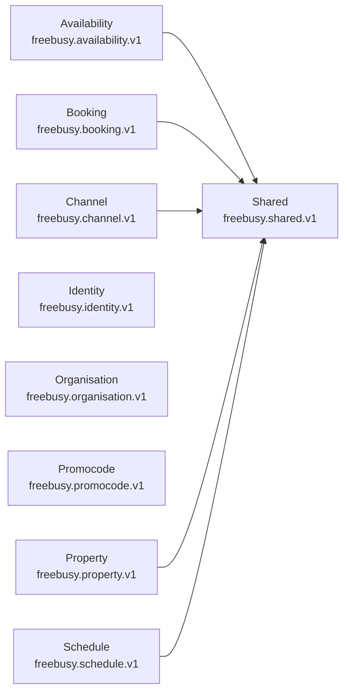

# Freebusy Protobuf APIs

> [!IMPORTANT]
> Auto-generated by `protodoc`. Do not edit manually.

Every protobuf module under `protobuf/`. Each row links to that module's generated reference.

## Modules

| Module | Package | Services | Messages | Enums | Reference |
| --- | --- | --- | --- | --- | --- |
| Availability | `freebusy.availability.v1` | 1 | 16 | 1 | [README](freebusy/availability/README.md) |
| Booking | `freebusy.booking.v1` | 1 | 11 | 2 | [README](freebusy/booking/README.md) |
| Channel | `freebusy.channel.v1` | 1 | 28 | 6 | [README](freebusy/channel/README.md) |
| Identity | `freebusy.identity.v1` | 1 | 5 | 0 | [README](freebusy/identity/README.md) |
| Organisation | `freebusy.organisation.v1` | 1 | 16 | 3 | [README](freebusy/organisation/README.md) |
| Promocode | `freebusy.promocode.v1` | 1 | 17 | 3 | [README](freebusy/promocode/README.md) |
| Property | `freebusy.property.v1` | 1 | 24 | 4 | [README](freebusy/property/README.md) |
| Schedule | `freebusy.schedule.v1` | 1 | 14 | 1 | [README](freebusy/schedule/README.md) |
| Shared | `freebusy.shared.v1` | 0 | 4 | 4 | [README](freebusy/shared/README.md) |
| **Total** | _9 modules_ | 8 | 135 | 24 | |

## Dependency graph

Local (`freebusy.*`) import relationships between modules. External deps (`google.*`, `mcp.*`) are omitted.

---

© 2026 oh-tarnished | Apache 2.0 License
