<!-- Code generated by protoc-gen-protorm. DO NOT EDIT. -->

# `v1` — GORM models

Go structs with GORM struct tags — one package per schema.

Generated from Protobuf by protoc-gen-protorm. Source of truth is the `.proto` files — regenerate rather than editing.

| Models | Enums |
| ---: | ---: |
| 27 | 10 |

## Entity relationships

```mermaid
erDiagram
    direction LR
    AvailabilityException {
        string id PK
        string resource_id FK
        string window_id FK
        string date_range_id FK
    }
    Booking {
        string id PK
        string resource FK
        string offering FK
        string customer FK
        string promo_code FK
        string contact_id FK
        string window_id FK
    }
    BufferSettings {
        string id PK
    }
    CancellationPolicy {
        string id PK
    }
    Contact {
        string id PK
    }
    DateRange {
        string id PK
    }
    Fee {
        string id PK
        string offering_id FK
    }
    LosDiscount {
        string id PK
        string offering_id FK
    }
    Member {
        string id PK
        string user FK
        string inviter FK
        string organisation_id FK
    }
    MembershipSummary {
        string id PK
        string organisation FK
        string user_id FK
    }
    Offering {
        string id PK
        string resource_id FK
    }
    Organisation {
        string id PK
    }
    PriceComponent {
        string id PK
        string booking_id FK
    }
    PromoCode {
        string id PK
    }
    PromoCodeApplicableOfferings {
        string id PK
        string promo_code_id FK
        string offering_id FK
    }
    PromoCodeApplicableResources {
        string id PK
        string promo_code_id FK
        string resource_id FK
    }
    RateOverride {
        string id PK
        string offering_id FK
        string date_range_id FK
    }
    RecurringRule {
        string id PK
        string schedule_id FK
    }
    RefundTier {
        string id PK
        string cancellation_policy_id FK
    }
    Resource {
        string id PK
    }
    ResourceOfferings {
        string id PK
        string resource_id FK
        string offering_id FK
    }
    Schedule {
        string id PK
        string buffers_id FK
        string stay_constraints_id FK
        string cancellation_policy_id FK
    }
    ScheduleExceptions {
        string id PK
        string schedule_id FK
        string availability_exception_id FK
    }
    StayConstraints {
        string id PK
    }
    Tax {
        string id PK
        string offering_id FK
    }
    TimeWindow {
        string id PK
    }
    User {
        string id PK
    }
    AvailabilityException }o--|| Resource : "resource_id"
    AvailabilityException }o--|| TimeWindow : "window_id"
    AvailabilityException }o--|| DateRange : "date_range_id"
    Booking }o--|| Resource : "resource"
    Booking }o--|| Offering : "offering"
    Booking }o--|| User : "customer"
    Booking }o--|| PromoCode : "promo_code"
    Booking }o--|| Contact : "contact_id"
    Booking }o--|| TimeWindow : "window_id"
    Fee }o--|| Offering : "offering_id"
    LosDiscount }o--|| Offering : "offering_id"
    Member }o--|| User : "user"
    Member }o--|| User : "inviter"
    Member }o--|| Organisation : "organisation_id"
    MembershipSummary }o--|| Organisation : "organisation"
    MembershipSummary }o--|| User : "user_id"
    Offering }o--|| Resource : "resource_id"
    PriceComponent }o--|| Booking : "booking_id"
    PromoCodeApplicableOfferings }o--|| PromoCode : "promo_code_id"
    PromoCodeApplicableOfferings }o--|| Offering : "offering_id"
    PromoCodeApplicableResources }o--|| PromoCode : "promo_code_id"
    PromoCodeApplicableResources }o--|| Resource : "resource_id"
    RateOverride }o--|| Offering : "offering_id"
    RateOverride }o--|| DateRange : "date_range_id"
    RecurringRule }o--|| Schedule : "schedule_id"
    RefundTier }o--|| CancellationPolicy : "cancellation_policy_id"
    ResourceOfferings }o--|| Resource : "resource_id"
    ResourceOfferings }o--|| Offering : "offering_id"
    Schedule }o--|| BufferSettings : "buffers_id"
    Schedule }o--|| StayConstraints : "stay_constraints_id"
    Schedule }o--|| CancellationPolicy : "cancellation_policy_id"
    ScheduleExceptions }o--|| Schedule : "schedule_id"
    ScheduleExceptions }o--|| AvailabilityException : "availability_exception_id"
    Tax }o--|| Offering : "offering_id"
```

## Output

- `<schema>/models.go` — one Go package per schema, one struct per table.
- Nullable columns are pointer types; proto enums become string-typed Go enums.
- Wire the structs into a `*gorm.DB`; run AutoMigrate, or apply the SQL target's DDL.

## Schema `freebusy_ohtarnished_dev`

### `Booking` → `bookings`

A reservation against a resource. The hold lifecycle lives here as states rather than a separate service: CreateBooking places a PENDING_HOLD, confirmation flips it to CONFIRMED, and an internal sweeper expires holds that are never confirmed.

| Column | Type | Null |
| --- | --- | --- |
| `id` | `CHAR(26)` | not null |
| `name` | `VARCHAR(255)` | not null |
| `resource` | `CHAR(26)` | not null |
| `offering` | `CHAR(26)` | nullable |
| `customer` | `CHAR(26)` | nullable |
| `units` | `INTEGER` | nullable |
| `assigned_unit` | `VARCHAR(255)` | nullable |
| `state` | `State` | nullable |
| `hold_expire_time` | `TIMESTAMPTZ` | nullable |
| `price` | `JSONB` | nullable |
| `promo_code` | `CHAR(26)` | nullable |
| `discount` | `JSONB` | nullable |
| `total` | `JSONB` | nullable |
| `notes` | `VARCHAR(255)` | nullable |
| `attributes` | `JSONB` | nullable |
| `cancel_reason` | `CancelReason` | nullable |
| `create_time` | `TIMESTAMPTZ` | not null |
| `update_time` | `TIMESTAMPTZ` | not null |
| `confirm_time` | `TIMESTAMPTZ` | nullable |
| `cancel_time` | `TIMESTAMPTZ` | nullable |
| `refund_amount` | `JSONB` | nullable |
| `refund_percent` | `INTEGER` | nullable |
| `hold_ttl` | `INTERVAL` | nullable |
| `etag` | `VARCHAR(255)` | nullable |
| `contact_id` | `CHAR(26)` | nullable |
| `window_id` | `CHAR(26)` | not null |

### `User` → `users`

A signed-in person. Identity is deliberately thin: actual login is an OIDC redirect flow handled over plain HTTP by the IdP, so most of "auth" never appears as an RPC. Email and identity come from the IdP and are read-only here; only profile preferences are editable.

| Column | Type | Null |
| --- | --- | --- |
| `id` | `CHAR(26)` | not null |
| `name` | `VARCHAR(255)` | not null |
| `email` | `VARCHAR(255)` | nullable |
| `display_name` | `VARCHAR(255)` | nullable |
| `avatar_url` | `VARCHAR(255)` | nullable |
| `locale` | `VARCHAR(255)` | nullable |
| `time_zone` | `VARCHAR(255)` | nullable |
| `create_time` | `TIMESTAMPTZ` | not null |
| `update_time` | `TIMESTAMPTZ` | not null |
| `etag` | `VARCHAR(255)` | nullable |

### `Organisation` → `organisations`

A tenant. Organisation is the unit of multi-tenancy; the shell enforces isolation with row-level security keyed off the caller's organisation, so most resource names stay flat and the organisation appears explicitly only here.

| Column | Type | Null |
| --- | --- | --- |
| `id` | `CHAR(26)` | not null |
| `name` | `VARCHAR(255)` | not null |
| `display_name` | `VARCHAR(255)` | not null |
| `slug` | `VARCHAR(255)` | nullable |
| `billing_email` | `VARCHAR(255)` | nullable |
| `state` | `State` | nullable |
| `settings` | `JSONB` | nullable |
| `member_count` | `BIGINT` | nullable |
| `create_time` | `TIMESTAMPTZ` | not null |
| `update_time` | `TIMESTAMPTZ` | not null |
| `etag` | `VARCHAR(255)` | nullable |

### `Member` → `members`

The membership of a user in an organisation, with their role.

| Column | Type | Null |
| --- | --- | --- |
| `id` | `CHAR(26)` | not null |
| `name` | `VARCHAR(255)` | not null |
| `user` | `CHAR(26)` | nullable |
| `email` | `VARCHAR(255)` | not null |
| `display_name` | `VARCHAR(255)` | nullable |
| `role` | `OrganisationRole` | not null |
| `state` | `State` | nullable |
| `inviter` | `CHAR(26)` | nullable |
| `create_time` | `TIMESTAMPTZ` | not null |
| `update_time` | `TIMESTAMPTZ` | not null |
| `etag` | `VARCHAR(255)` | nullable |
| `organisation_id` | `CHAR(26)` | not null |

### `PromoCode` → `promo_codes`

A redeemable discount applied to a booking's subtotal. Scoped by a redemption window, usage caps, a minimum subtotal, and an optional set of resources / offerings it applies to.

| Column | Type | Null |
| --- | --- | --- |
| `id` | `CHAR(26)` | not null |
| `name` | `VARCHAR(255)` | not null |
| `code` | `VARCHAR(255)` | not null |
| `display_name` | `VARCHAR(255)` | nullable |
| `description` | `VARCHAR(255)` | nullable |
| `discount_type` | `DiscountType` | not null |
| `percent_off` | `INTEGER` | nullable |
| `amount_off` | `JSONB` | nullable |
| `redeem_start_time` | `TIMESTAMPTZ` | nullable |
| `redeem_end_time` | `TIMESTAMPTZ` | nullable |
| `max_redemptions` | `BIGINT` | nullable |
| `per_customer_limit` | `INTEGER` | nullable |
| `min_subtotal` | `JSONB` | nullable |
| `redemption_count` | `BIGINT` | nullable |
| `state` | `State` | nullable |
| `disabled` | `BOOLEAN` | nullable |
| `create_time` | `TIMESTAMPTZ` | not null |
| `update_time` | `TIMESTAMPTZ` | not null |
| `etag` | `VARCHAR(255)` | nullable |

### `Resource` → `resources`

A bookable thing: a provider, room, piece of equipment, or a unit type. A resource is a pool of `capacity` interchangeable units; the freebusy engine computes how many are free for a given window. Its booking_mode decides whether availability is produced as time slots or per-night counts.

| Column | Type | Null |
| --- | --- | --- |
| `id` | `CHAR(26)` | not null |
| `name` | `VARCHAR(255)` | not null |
| `display_name` | `VARCHAR(255)` | not null |
| `description` | `VARCHAR(255)` | nullable |
| `type` | `ResourceType` | not null |
| `booking_mode` | `BookingMode` | not null |
| `capacity` | `INTEGER` | nullable |
| `time_zone` | `VARCHAR(255)` | not null |
| `tags` | `VARCHAR(255)[]` | nullable |
| `attributes` | `JSONB` | nullable |
| `state` | `State` | nullable |
| `create_time` | `TIMESTAMPTZ` | not null |
| `update_time` | `TIMESTAMPTZ` | not null |
| `etag` | `VARCHAR(255)` | nullable |

### `Offering` → `offerings`

A specific way a resource can be booked, carrying its duration and price. A "30-min consult" and a "60-min session" are two offerings on the same provider. For NIGHTLY resources the duration is unused and price is per-night.

| Column | Type | Null |
| --- | --- | --- |
| `id` | `CHAR(26)` | not null |
| `name` | `VARCHAR(255)` | not null |
| `display_name` | `VARCHAR(255)` | not null |
| `description` | `VARCHAR(255)` | nullable |
| `duration` | `INTERVAL` | nullable |
| `price` | `JSONB` | nullable |
| `pricing_unit` | `PricingUnit` | nullable |
| `state` | `State` | nullable |
| `create_time` | `TIMESTAMPTZ` | not null |
| `update_time` | `TIMESTAMPTZ` | not null |
| `etag` | `VARCHAR(255)` | nullable |
| `resource_id` | `CHAR(26)` | not null |

### `AvailabilityException` → `availability_exceptions`

An override of a resource's normal hours on a specific span: a blackout / holiday closure, or extra hours beyond the recurring rules.

| Column | Type | Null |
| --- | --- | --- |
| `id` | `CHAR(26)` | not null |
| `name` | `VARCHAR(255)` | not null |
| `kind` | `ExceptionKind` | not null |
| `reason` | `VARCHAR(255)` | nullable |
| `create_time` | `TIMESTAMPTZ` | not null |
| `span_case` | `AvailabilityExceptionSpanCase` | nullable |
| `resource_id` | `CHAR(26)` | not null |
| `window_id` | `CHAR(26)` | nullable |
| `date_range_id` | `CHAR(26)` | nullable |

### `Schedule` → `schedules`

Aggregate read view of a resource's availability configuration: the inputs the freebusy engine consumes. Modeled as a singleton resource, one per resource.

| Column | Type | Null |
| --- | --- | --- |
| `id` | `CHAR(26)` | not null |
| `name` | `VARCHAR(255)` | not null |
| `etag` | `VARCHAR(255)` | nullable |
| `buffers_id` | `CHAR(26)` | nullable |
| `stay_constraints_id` | `CHAR(26)` | nullable |
| `cancellation_policy_id` | `CHAR(26)` | nullable |

### `Contact` → `contacts`

Contact details for the person a booking is for. When a booking carries a `customer` (a users/{user} reference) these typically mirror the user's profile; for walk-in or email-only bookings made by someone who is not a registered user, this is the only contact information captured. The server requires at least one reachable channel (email or phone) when no customer is set.

| Column | Type | Null |
| --- | --- | --- |
| `id` | `CHAR(26)` | not null |
| `display_name` | `VARCHAR(255)` | nullable |
| `email` | `VARCHAR(255)` | nullable |
| `phone_number` | `VARCHAR(255)` | nullable |

### `TimeWindow` → `time_windows`

A half-open time interval [start_time, end_time). Used for query windows and for a booking's reserved span in both TIME_SLOT and NIGHTLY modes.

| Column | Type | Null |
| --- | --- | --- |
| `id` | `CHAR(26)` | not null |
| `start_time` | `TIMESTAMPTZ` | not null |
| `end_time` | `TIMESTAMPTZ` | not null |

### `PriceComponent` → `price_components`

One line in a price breakdown: a base charge, a fee, a tax, or a discount. Clients branch on `type` and `code`; the signed `amount` rolls up to the booking total (charges positive, discounts negative).

| Column | Type | Null |
| --- | --- | --- |
| `id` | `CHAR(26)` | not null |
| `type` | `Type` | nullable |
| `code` | `VARCHAR(255)` | nullable |
| `display_name` | `VARCHAR(255)` | nullable |
| `amount` | `JSONB` | nullable |
| `booking_id` | `CHAR(26)` | not null |

### `MembershipSummary` → `membership_summaries`

A compact view of an organisation the user belongs to.

| Column | Type | Null |
| --- | --- | --- |
| `id` | `CHAR(26)` | not null |
| `organisation` | `CHAR(26)` | nullable |
| `org_display_name` | `VARCHAR(255)` | nullable |
| `role` | `VARCHAR(255)` | nullable |
| `user_id` | `CHAR(26)` | not null |

### `RateOverride` → `rate_overrides`

A price override for a span of dates and/or specific weekdays, layered over an offering's base `price`. The price is still interpreted per the offering's pricing_unit (per night, per booking, per person).

| Column | Type | Null |
| --- | --- | --- |
| `id` | `CHAR(26)` | not null |
| `weekdays` | `[]` | nullable |
| `price` | `JSONB` | not null |
| `offering_id` | `CHAR(26)` | not null |
| `date_range_id` | `CHAR(26)` | nullable |

### `LosDiscount` → `los_discounts`

A discount applied to a NIGHTLY subtotal once the stay reaches a minimum length. Exactly one of percent_off or amount_off is set.

| Column | Type | Null |
| --- | --- | --- |
| `id` | `CHAR(26)` | not null |
| `min_nights` | `INTEGER` | not null |
| `percent_off` | `INTEGER` | nullable |
| `amount_off` | `JSONB` | nullable |
| `offering_id` | `CHAR(26)` | not null |

### `Fee` → `fees`

A fee added on top of an offering's base subtotal. Exactly one of `amount` or `percent` is set. Surfaces as a TYPE_FEE line in a booking's price_components.

| Column | Type | Null |
| --- | --- | --- |
| `id` | `CHAR(26)` | not null |
| `code` | `VARCHAR(255)` | not null |
| `display_name` | `VARCHAR(255)` | nullable |
| `amount` | `JSONB` | nullable |
| `percent` | `INTEGER` | nullable |
| `pricing_unit` | `PricingUnit` | nullable |
| `taxable` | `BOOLEAN` | nullable |
| `offering_id` | `CHAR(26)` | not null |

### `Tax` → `taxes`

A tax applied to the taxable base (base subtotal plus taxable fees). Surfaces as a TYPE_TAX line in a booking's price_components.

| Column | Type | Null |
| --- | --- | --- |
| `id` | `CHAR(26)` | not null |
| `code` | `VARCHAR(255)` | not null |
| `display_name` | `VARCHAR(255)` | nullable |
| `percent` | `DOUBLE PRECISION` | not null |
| `offering_id` | `CHAR(26)` | not null |

### `DateRange` → `date_ranges`

A half-open range of calendar dates [start_date, end_date), evaluated in the resource's local timezone. The natural query and exception shape for NIGHTLY resources: end_date is the check-out date and is not itself included.

| Column | Type | Null |
| --- | --- | --- |
| `id` | `CHAR(26)` | not null |
| `start_date` | `DATE` | not null |
| `end_date` | `DATE` | not null |

### `RecurringRule` → `recurring_rules`

A recurring availability window expressed as an RRULE plus a daily open span. The freebusy engine expands these against the resource's timezone.

| Column | Type | Null |
| --- | --- | --- |
| `id` | `CHAR(26)` | not null |
| `rrule` | `VARCHAR(255)` | not null |
| `opens` | `VARCHAR(255)` | nullable |
| `closes` | `VARCHAR(255)` | nullable |
| `schedule_id` | `CHAR(26)` | not null |

### `BufferSettings` → `buffer_settings`

Buffer and notice settings applied around bookings.

| Column | Type | Null |
| --- | --- | --- |
| `id` | `CHAR(26)` | not null |
| `start_delta` | `INTERVAL` | nullable |
| `end_delta` | `INTERVAL` | nullable |
| `min_notice` | `INTERVAL` | nullable |
| `max_advance` | `INTERVAL` | nullable |
| `gap` | `INTERVAL` | nullable |

### `StayConstraints` → `stay_constraints`

Stay rules that affect bookability for NIGHTLY resources.

| Column | Type | Null |
| --- | --- | --- |
| `id` | `CHAR(26)` | not null |
| `min_nights` | `INTEGER` | nullable |
| `max_nights` | `INTEGER` | nullable |
| `checkin_weekdays` | `[]` | nullable |
| `checkout_weekdays` | `[]` | nullable |
| `advance_min_days` | `INTEGER` | nullable |
| `advance_max_days` | `INTEGER` | nullable |

### `CancellationPolicy` → `cancellation_policies`

Refund rules graded by how far ahead of a booking's start it is cancelled.

| Column | Type | Null |
| --- | --- | --- |
| `id` | `CHAR(26)` | not null |

### `RefundTier` → `refund_tiers`

One tier of a CancellationPolicy: cancel at least `cutoff` before the booking start to receive `refund_percent` of the total back.

| Column | Type | Null |
| --- | --- | --- |
| `id` | `CHAR(26)` | not null |
| `cutoff` | `INTERVAL` | not null |
| `refund_percent` | `INTEGER` | not null |
| `cancellation_policy_id` | `CHAR(26)` | not null |

### `PromoCodeApplicableResources` → `promo_code_applicable_resources`

Join table for the many-to-many relation PromoCode.applicable_resources ↔ Resource.

| Column | Type | Null |
| --- | --- | --- |
| `id` | `CHAR(26)` | not null |
| `promo_code_id` | `CHAR(26)` | not null |
| `resource_id` | `CHAR(26)` | not null |

### `PromoCodeApplicableOfferings` → `promo_code_applicable_offerings`

Join table for the many-to-many relation PromoCode.applicable_offerings ↔ Offering.

| Column | Type | Null |
| --- | --- | --- |
| `id` | `CHAR(26)` | not null |
| `promo_code_id` | `CHAR(26)` | not null |
| `offering_id` | `CHAR(26)` | not null |

### `ResourceOfferings` → `resource_offerings`

Join table for the many-to-many relation Resource.offerings ↔ Offering.

| Column | Type | Null |
| --- | --- | --- |
| `id` | `CHAR(26)` | not null |
| `resource_id` | `CHAR(26)` | not null |
| `offering_id` | `CHAR(26)` | not null |

### `ScheduleExceptions` → `schedule_exceptions`

Join table for the many-to-many relation Schedule.exceptions ↔ AvailabilityException.

| Column | Type | Null |
| --- | --- | --- |
| `id` | `CHAR(26)` | not null |
| `schedule_id` | `CHAR(26)` | not null |
| `availability_exception_id` | `CHAR(26)` | not null |

### Enums

- `State`: PENDING_HOLD, CONFIRMED, CANCELLED, EXPIRED, COMPLETED, NO_SHOW
- `CancelReason`: REQUESTED_BY_CUSTOMER, REQUESTED_BY_OPERATOR, PAYMENT_FAILED, NO_SHOW, OTHER
- `OrganisationRole`: OWNER, ADMIN, MEMBER, VIEWER
- `DiscountType`: PERCENTAGE, FIXED_AMOUNT
- `ResourceType`: PROVIDER, ROOM, EQUIPMENT, UNIT_TYPE, SPACE
- `BookingMode`: TIME_SLOT, NIGHTLY
- `PricingUnit`: PER_BOOKING, PER_NIGHT, PER_PERSON
- `ExceptionKind`: CLOSURE, EXTRA_HOURS
- `AvailabilityExceptionSpanCase`: WINDOW, DATE_RANGE
- `Type`: BASE, FEE, TAX, DISCOUNT
