<!-- Code generated by protoc-gen-protorm. DO NOT EDIT. -->

# `freebusy/` — Prisma schema

Generated from Protobuf by protoc-gen-protorm. Source of truth is the `.proto` files — regenerate rather than editing.

| Models | Enums |
| ---: | ---: |
| 28 | 15 |

## Entity relationships

```mermaid
erDiagram
    direction LR
    AvailabilityException {
        string id PK
        string resource_id FK
        string window_id FK
        string date_range_id FK
    }
    Booking {
        string id PK
        string resource FK
        string offering FK
        string customer FK
        string promo_code FK
        string contact_id FK
        string window_id FK
        string price_id FK
        string discount_id FK
        string total_id FK
        string refund_amount_id FK
    }
    BufferSettings {
        string id PK
    }
    CancellationPolicy {
        string id PK
    }
    Contact {
        string id PK
    }
    DateRange {
        string id PK
    }
    Fee {
        string id PK
        string offering_id FK
        string amount_id FK
    }
    LosDiscount {
        string id PK
        string offering_id FK
        string amount_off_id FK
    }
    Member {
        string id PK
        string user FK
        string inviter FK
        string organisation_id FK
    }
    MembershipSummary {
        string id PK
        string organisation FK
        string user_id FK
    }
    Money {
        string id PK
    }
    Offering {
        string id PK
        string resource_id FK
        string price_id FK
    }
    Organisation {
        string id PK
    }
    PriceComponent {
        string id PK
        string booking_id FK
        string amount_id FK
    }
    PromoCode {
        string id PK
        string amount_off_id FK
        string min_subtotal_id FK
    }
    PromoCodeApplicableOfferings {
        string id PK
        string promo_code_id FK
        string offering_id FK
    }
    PromoCodeApplicableResources {
        string id PK
        string promo_code_id FK
        string resource_id FK
    }
    RateOverride {
        string id PK
        string offering_id FK
        string date_range_id FK
        string price_id FK
    }
    RecurringRule {
        string id PK
        string schedule_id FK
    }
    RefundTier {
        string id PK
        string cancellation_policy_id FK
    }
    Resource {
        string id PK
    }
    ResourceOfferings {
        string id PK
        string resource_id FK
        string offering_id FK
    }
    Schedule {
        string id PK
        string buffers_id FK
        string stay_constraints_id FK
        string cancellation_policy_id FK
    }
    ScheduleExceptions {
        string id PK
        string schedule_id FK
        string availability_exception_id FK
    }
    StayConstraints {
        string id PK
    }
    Tax {
        string id PK
        string offering_id FK
    }
    TimeWindow {
        string id PK
    }
    User {
        string id PK
    }
    AvailabilityException }o--|| Resource : "resource_id"
    AvailabilityException }o--|| TimeWindow : "window_id"
    AvailabilityException }o--|| DateRange : "date_range_id"
    Booking }o--|| Resource : "resource"
    Booking }o--|| Offering : "offering"
    Booking }o--|| User : "customer"
    Booking }o--|| PromoCode : "promo_code"
    Booking }o--|| Contact : "contact_id"
    Booking }o--|| TimeWindow : "window_id"
    Booking }o--|| Money : "price_id"
    Booking }o--|| Money : "discount_id"
    Booking }o--|| Money : "total_id"
    Booking }o--|| Money : "refund_amount_id"
    Fee }o--|| Offering : "offering_id"
    Fee }o--|| Money : "amount_id"
    LosDiscount }o--|| Offering : "offering_id"
    LosDiscount }o--|| Money : "amount_off_id"
    Member }o--|| User : "user"
    Member }o--|| User : "inviter"
    Member }o--|| Organisation : "organisation_id"
    MembershipSummary }o--|| Organisation : "organisation"
    MembershipSummary }o--|| User : "user_id"
    Offering }o--|| Resource : "resource_id"
    Offering }o--|| Money : "price_id"
    PriceComponent }o--|| Booking : "booking_id"
    PriceComponent }o--|| Money : "amount_id"
    PromoCode }o--|| Money : "amount_off_id"
    PromoCode }o--|| Money : "min_subtotal_id"
    PromoCodeApplicableOfferings }o--|| PromoCode : "promo_code_id"
    PromoCodeApplicableOfferings }o--|| Offering : "offering_id"
    PromoCodeApplicableResources }o--|| PromoCode : "promo_code_id"
    PromoCodeApplicableResources }o--|| Resource : "resource_id"
    RateOverride }o--|| Offering : "offering_id"
    RateOverride }o--|| DateRange : "date_range_id"
    RateOverride }o--|| Money : "price_id"
    RecurringRule }o--|| Schedule : "schedule_id"
    RefundTier }o--|| CancellationPolicy : "cancellation_policy_id"
    ResourceOfferings }o--|| Resource : "resource_id"
    ResourceOfferings }o--|| Offering : "offering_id"
    Schedule }o--|| BufferSettings : "buffers_id"
    Schedule }o--|| StayConstraints : "stay_constraints_id"
    Schedule }o--|| CancellationPolicy : "cancellation_policy_id"
    ScheduleExceptions }o--|| Schedule : "schedule_id"
    ScheduleExceptions }o--|| AvailabilityException : "availability_exception_id"
    Tax }o--|| Offering : "offering_id"
```

## Subfolders

- [`booking/`](./booking/README.md)
- [`identity/`](./identity/README.md)
- [`organisation/`](./organisation/README.md)
- [`promocode/`](./promocode/README.md)
- [`resource/`](./resource/README.md)
- [`schedule/`](./schedule/README.md)
- [`shared/`](./shared/README.md)
- [`type/`](./type/README.md)
