<!-- Code generated by protoc-gen-orm. DO NOT EDIT. -->

# `freebusy/` — Prisma schema

Generated from Protobuf by protoc-gen-orm. Source of truth is the `.proto` files — regenerate rather than editing.

| Models | Enums |
| ---: | ---: |
| 48 | 28 |

## Entity relationships

```mermaid
erDiagram
    direction LR
    Attachment {
        string id PK
    }
    AvailabilityException {
        string id PK
        string property_id FK
        string unit_id FK
        string window_id FK
        string date_range_id FK
    }
    Booking {
        string id PK
        string unit FK
        string customer FK
        string promo_code FK
        string contact_id FK
        string occupancy_id FK
        string window_id FK
        string price_id FK
        string discount_id FK
        string total_id FK
        string refund_amount_id FK
    }
    BufferSettings {
        string id PK
    }
    CancellationPolicy {
        string id PK
    }
    Channel {
        string id PK
        string property FK
    }
    ChannelSyncStatus {
        string id PK
    }
    Contact {
        string id PK
    }
    DateRange {
        string id PK
    }
    Discount {
        string id PK
        string amount_off_id FK
    }
    Fee {
        string id PK
        string unit_id FK
        string amount_id FK
    }
    ForeignerDetails {
        string id PK
    }
    Guest {
        string id PK
        string booking_id FK
        string id_document_id FK
        string permanent_address_id FK
        string local_address_id FK
        string foreigner_id FK
        string preferences_id FK
    }
    GuestPreferences {
        string id PK
    }
    IdDocument {
        string id PK
        string attachment_id FK
    }
    IdempotencyKey {
        string id PK
    }
    Licence {
        string id PK
        string unit FK
        string property_id FK
        string attachment_id FK
    }
    LosDiscount {
        string id PK
        string unit_id FK
        string amount_off_id FK
    }
    Media {
        string id PK
        string property_id FK
    }
    Member {
        string id PK
        string user FK
        string inviter FK
        string organisation_id FK
    }
    Money {
        string id PK
    }
    Occupancy {
        string id PK
    }
    Organisation {
        string id PK
    }
    Policy {
        string id PK
    }
    PostalAddress {
        string id PK
    }
    PriceComponent {
        string id PK
        string booking_id FK
        string amount_id FK
    }
    PromoCode {
        string id PK
        string discount_id FK
        string window_id FK
        string limits_id FK
        string scope_id FK
    }
    Property {
        string id PK
        string organisation FK
        string address_id FK
        string policy_id FK
    }
    PropertyUnits {
        string id PK
        string property_id FK
        string unit_id FK
    }
    RateOverride {
        string id PK
        string unit_id FK
        string date_range_id FK
        string price_id FK
    }
    RecurringRule {
        string id PK
        string schedule_id FK
    }
    Redemption {
        string id PK
        string customer FK
        string booking FK
        string promo_code_id FK
        string amount_applied_id FK
    }
    RedemptionWindow {
        string id PK
    }
    RefundTier {
        string id PK
        string cancellation_policy_id FK
    }
    Schedule {
        string id PK
        string property_id FK
        string buffers_id FK
        string stay_constraints_id FK
        string cancellation_policy_id FK
    }
    ScheduleExceptions {
        string id PK
        string schedule_id FK
        string availability_exception_id FK
    }
    Scope {
        string id PK
        string min_subtotal_id FK
    }
    ScopeApplicableProperties {
        string id PK
        string scope_id FK
        string property_id FK
    }
    ScopeApplicableUnits {
        string id PK
        string scope_id FK
        string unit_id FK
    }
    StayConstraints {
        string id PK
    }
    Tax {
        string id PK
        string unit_id FK
    }
    TimeWindow {
        string id PK
    }
    Unit {
        string id PK
        string property_id FK
        string price_id FK
    }
    UnitApplicablePromoCodes {
        string id PK
        string unit_id FK
        string promo_code_id FK
    }
    UnitMapping {
        string id PK
        string unit FK
        string channel_id FK
    }
    UnitMedia {
        string id PK
        string unit_id FK
    }
    UsageLimits {
        string id PK
    }
    User {
        string id PK
    }
    AvailabilityException }o--|| Property : "property_id"
    AvailabilityException }o--|| Unit : "unit_id"
    AvailabilityException }o--|| TimeWindow : "window_id"
    AvailabilityException }o--|| DateRange : "date_range_id"
    Booking }o--|| Unit : "unit"
    Booking }o--|| User : "customer"
    Booking }o--|| PromoCode : "promo_code"
    Booking }o--|| Contact : "contact_id"
    Booking }o--|| Occupancy : "occupancy_id"
    Booking }o--|| TimeWindow : "window_id"
    Booking }o--|| Money : "price_id"
    Booking }o--|| Money : "discount_id"
    Booking }o--|| Money : "total_id"
    Booking }o--|| Money : "refund_amount_id"
    Channel }o--|| Property : "property"
    Discount }o--|| Money : "amount_off_id"
    Fee }o--|| Unit : "unit_id"
    Fee }o--|| Money : "amount_id"
    Guest }o--|| Booking : "booking_id"
    Guest }o--|| IdDocument : "id_document_id"
    Guest }o--|| PostalAddress : "permanent_address_id"
    Guest }o--|| PostalAddress : "local_address_id"
    Guest }o--|| ForeignerDetails : "foreigner_id"
    Guest }o--|| GuestPreferences : "preferences_id"
    IdDocument }o--|| Attachment : "attachment_id"
    Licence }o--|| Unit : "unit"
    Licence }o--|| Property : "property_id"
    Licence }o--|| Attachment : "attachment_id"
    LosDiscount }o--|| Unit : "unit_id"
    LosDiscount }o--|| Money : "amount_off_id"
    Media }o--|| Property : "property_id"
    Member }o--|| User : "user"
    Member }o--|| User : "inviter"
    Member }o--|| Organisation : "organisation_id"
    PriceComponent }o--|| Booking : "booking_id"
    PriceComponent }o--|| Money : "amount_id"
    PromoCode }o--|| Discount : "discount_id"
    PromoCode }o--|| RedemptionWindow : "window_id"
    PromoCode }o--|| UsageLimits : "limits_id"
    PromoCode }o--|| Scope : "scope_id"
    Property }o--|| Organisation : "organisation"
    Property }o--|| PostalAddress : "address_id"
    Property }o--|| Policy : "policy_id"
    PropertyUnits }o--|| Property : "property_id"
    PropertyUnits }o--|| Unit : "unit_id"
    RateOverride }o--|| Unit : "unit_id"
    RateOverride }o--|| DateRange : "date_range_id"
    RateOverride }o--|| Money : "price_id"
    RecurringRule }o--|| Schedule : "schedule_id"
    Redemption }o--|| User : "customer"
    Redemption }o--|| Booking : "booking"
    Redemption }o--|| PromoCode : "promo_code_id"
    Redemption }o--|| Money : "amount_applied_id"
    RefundTier }o--|| CancellationPolicy : "cancellation_policy_id"
    Schedule }o--|| Property : "property_id"
    Schedule }o--|| BufferSettings : "buffers_id"
    Schedule }o--|| StayConstraints : "stay_constraints_id"
    Schedule }o--|| CancellationPolicy : "cancellation_policy_id"
    ScheduleExceptions }o--|| Schedule : "schedule_id"
    ScheduleExceptions }o--|| AvailabilityException : "availability_exception_id"
    Scope }o--|| Money : "min_subtotal_id"
    ScopeApplicableProperties }o--|| Scope : "scope_id"
    ScopeApplicableProperties }o--|| Property : "property_id"
    ScopeApplicableUnits }o--|| Scope : "scope_id"
    ScopeApplicableUnits }o--|| Unit : "unit_id"
    Tax }o--|| Unit : "unit_id"
    Unit }o--|| Property : "property_id"
    Unit }o--|| Money : "price_id"
    UnitApplicablePromoCodes }o--|| Unit : "unit_id"
    UnitApplicablePromoCodes }o--|| PromoCode : "promo_code_id"
    UnitMapping }o--|| Unit : "unit"
    UnitMapping }o--|| Channel : "channel_id"
    UnitMedia }o--|| Unit : "unit_id"
```

## Subfolders

- [`booking/`](./booking/README.md)
- [`channel/`](./channel/README.md)
- [`identity/`](./identity/README.md)
- [`organisation/`](./organisation/README.md)
- [`promocode/`](./promocode/README.md)
- [`property/`](./property/README.md)
- [`schedule/`](./schedule/README.md)
- [`shared/`](./shared/README.md)
- [`type/`](./type/README.md)
