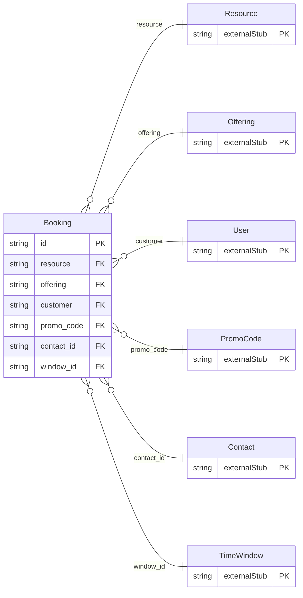

<!-- Code generated by protoc-gen-protorm. DO NOT EDIT. -->

# `freebusy/booking/booking/` — Prisma schema

Generated from Protobuf by protoc-gen-protorm. Source of truth is the `.proto` files — regenerate rather than editing.

| Models | Enums |
| ---: | ---: |
| 1 | 2 |

## Entity relationships

Schema file: [`booking.postgres.prisma`](./booking.postgres.prisma)

### `Booking` → `resource`

A reservation against a resource. The hold lifecycle lives here as states rather than a separate service: CreateBooking places a PENDING_HOLD, confirmation flips it to CONFIRMED, and an internal sweeper expires holds that are never confirmed.

| Column | Type | Null |
| --- | --- | --- |
| `id` | `CHAR(26)` | not null |
| `name` | `VARCHAR(255)` | not null |
| `resource` | `CHAR(26)` | not null |
| `offering` | `CHAR(26)` | nullable |
| `customer` | `CHAR(26)` | nullable |
| `units` | `INTEGER` | nullable |
| `assigned_unit` | `VARCHAR(255)` | nullable |
| `state` | `BookingState` | nullable |
| `hold_expire_time` | `TIMESTAMPTZ` | nullable |
| `price` | `JSONB` | nullable |
| `promo_code` | `CHAR(26)` | nullable |
| `discount` | `JSONB` | nullable |
| `total` | `JSONB` | nullable |
| `notes` | `VARCHAR(255)` | nullable |
| `attributes` | `JSONB` | nullable |
| `cancel_reason` | `CancelReason` | nullable |
| `create_time` | `TIMESTAMPTZ` | not null |
| `update_time` | `TIMESTAMPTZ` | not null |
| `confirm_time` | `TIMESTAMPTZ` | nullable |
| `cancel_time` | `TIMESTAMPTZ` | nullable |
| `refund_amount` | `JSONB` | nullable |
| `refund_percent` | `INTEGER` | nullable |
| `hold_ttl` | `INTERVAL` | nullable |
| `etag` | `VARCHAR(255)` | nullable |
| `contact_id` | `CHAR(26)` | nullable |
| `window_id` | `CHAR(26)` | not null |

### Enums

- `BookingState`: PENDING_HOLD, CONFIRMED, CANCELLED, EXPIRED, COMPLETED, NO_SHOW
- `CancelReason`: REQUESTED_BY_CUSTOMER, REQUESTED_BY_OPERATOR, PAYMENT_FAILED, NO_SHOW, OTHER
