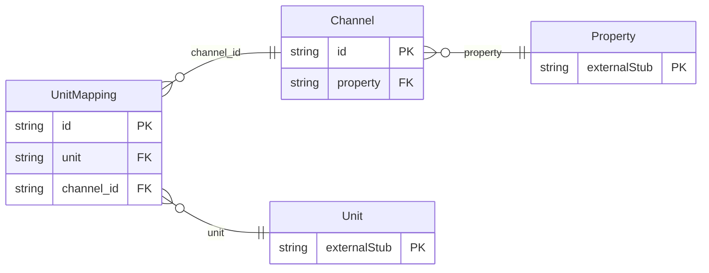

<!-- Code generated by protoc-gen-orm. DO NOT EDIT. -->

# `freebusy/channel/channel/` — Prisma schema

Generated from Protobuf by protoc-gen-orm. Source of truth is the `.proto` files — regenerate rather than editing.

| Models | Enums |
| ---: | ---: |
| 2 | 0 |

## Entity relationships

Schema file: [`channel.postgres.prisma`](./channel.postgres.prisma)

### `Channel` → `resource`

A connection between one property and one distribution channel (OTA/GDS). It is the anchor for 2-way ARI: availability/rates/inventory are pushed out per mapped unit, and reservations made on the channel are pulled in as bookings. Credentials are never carried in the API — only an opaque handle to where they are stored.

| Column | Type | Null |
| --- | --- | --- |
| `id` | `CHAR(26)` | not null |
| `name` | `VARCHAR(255)` | not null |
| `property` | `CHAR(26)` | not null |
| `type` | `ChannelType` | not null |
| `display_name` | `VARCHAR(255)` | nullable |
| `external_property_id` | `VARCHAR(255)` | nullable |
| `credential_ref` | `VARCHAR(255)` | nullable |
| `state` | `ChannelState` | nullable |
| `last_sync_time` | `TIMESTAMPTZ` | nullable |
| `create_time` | `TIMESTAMPTZ` | not null |
| `update_time` | `TIMESTAMPTZ` | not null |
| `etag` | `VARCHAR(255)` | nullable |

### `UnitMapping` → `unit_mappings`

Maps a freebusy Unit to its counterpart on the channel. ARI for a unit only flows once a MAPPED mapping exists: the external room-type and rate-plan ids key the availability/rate/restriction push and resolve inbound reservations back to the right unit.

| Column | Type | Null |
| --- | --- | --- |
| `id` | `CHAR(26)` | not null |
| `name` | `VARCHAR(255)` | not null |
| `unit` | `CHAR(26)` | not null |
| `external_room_type_id` | `VARCHAR(255)` | not null |
| `external_rate_plan_id` | `VARCHAR(255)` | nullable |
| `state` | `MappingState` | nullable |
| `create_time` | `TIMESTAMPTZ` | not null |
| `update_time` | `TIMESTAMPTZ` | not null |
| `etag` | `VARCHAR(255)` | nullable |
| `channel_id` | `CHAR(26)` | not null |
