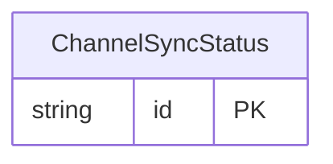

<!-- Code generated by protoc-gen-orm. DO NOT EDIT. -->

# `freebusy/channel/channel_messages/` — Prisma schema

Generated from Protobuf by protoc-gen-orm. Source of truth is the `.proto` files — regenerate rather than editing.

| Models | Enums |
| ---: | ---: |
| 1 | 0 |

## Entity relationships

Schema file: [`channel_messages.postgres.prisma`](./channel_messages.postgres.prisma)

### `ChannelSyncStatus` → `sync_statuses`

A rollup of a channel's sync health, modeled as a singleton sub-resource of the channel (one per channel) and read via GetChannelSyncStatus.

| Column | Type | Null |
| --- | --- | --- |
| `id` | `CHAR(26)` | not null |
| `name` | `VARCHAR(255)` | not null |
| `state` | `ChannelState` | nullable |
| `last_sync_time` | `TIMESTAMPTZ` | nullable |
| `pending_count` | `INTEGER` | nullable |
| `failed_count` | `INTEGER` | nullable |
| `last_error` | `VARCHAR(255)` | nullable |
