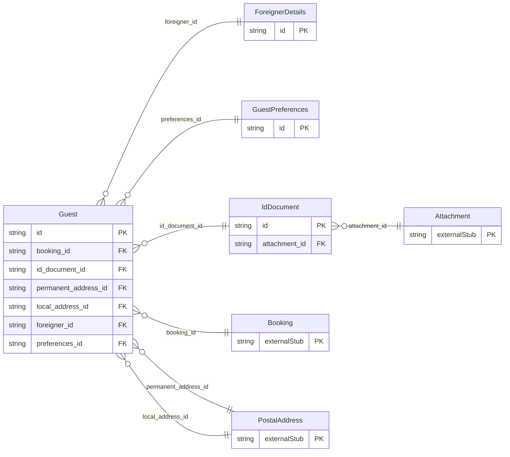

<!-- Code generated by protoc-gen-orm. DO NOT EDIT. -->

# `freebusy/identity/guest/` — Prisma schema

Generated from Protobuf by protoc-gen-orm. Source of truth is the `.proto` files — regenerate rather than editing.

| Models | Enums |
| ---: | ---: |
| 4 | 0 |

## Entity relationships

Schema file: [`guest.postgres.prisma`](./guest.postgres.prisma)

### `Guest` → `guests`

A guest is a person who stays under a booking. It is one of three distinct people the system models, all in the identity domain: - User   (identity.proto): the account that signs in and books online. - Guest  (this message):   a person actually staying — the party on a booking. - Member (organisation):   hotel staff who manage the chain/property. The booker (a User, or an anonymous contact) is not necessarily a guest, and a booking has one or more guests. This message captures what a hotel records on a Guest Registration Card at check-in — identity, nationality, and ID — plus the foreigner-registration details required for foreign nationals (e.g. India's Form C / FRRO), and the guest's own stay preferences. It is an embedded value on a booking, not an addressable account resource.

| Column | Type | Null |
| --- | --- | --- |
| `id` | `CHAR(26)` | not null |
| `display_name` | `VARCHAR(255)` | not null |
| `primary` | `BOOLEAN` | nullable |
| `gender` | `Gender` | nullable |
| `birth_date` | `DATE` | nullable |
| `age_group` | `AgeGroup` | nullable |
| `nationality` | `VARCHAR(255)` | nullable |
| `email` | `VARCHAR(255)` | nullable |
| `phone_number` | `VARCHAR(255)` | nullable |
| `booking_id` | `CHAR(26)` | not null |
| `id_document_id` | `CHAR(26)` | nullable |
| `permanent_address_id` | `CHAR(26)` | nullable |
| `local_address_id` | `CHAR(26)` | nullable |
| `foreigner_id` | `CHAR(26)` | nullable |
| `preferences_id` | `CHAR(26)` | nullable |

### `IdDocument` → `id_documents`

A government identity document. Passport fields are required for foreign nationals; domestic guests may present any accepted document type.

| Column | Type | Null |
| --- | --- | --- |
| `id` | `CHAR(26)` | not null |
| `type` | `IdDocumentType` | not null |
| `number` | `VARCHAR(255)` | not null |
| `issuing_country` | `VARCHAR(255)` | nullable |
| `issue_place` | `VARCHAR(255)` | nullable |
| `issue_date` | `DATE` | nullable |
| `expiry_date` | `DATE` | nullable |
| `attachment_id` | `CHAR(26)` | nullable |

### `ForeignerDetails` → `foreigner_details`

Foreigner-registration details a hotel must capture for foreign nationals to file Form C with the FRRO within 24 hours of arrival (India). Nationals of exempt countries (e.g. Nepal, Bhutan) and diplomats may omit these.

| Column | Type | Null |
| --- | --- | --- |
| `id` | `CHAR(26)` | not null |
| `visa_number` | `VARCHAR(255)` | nullable |
| `visa_type` | `VARCHAR(255)` | nullable |
| `visa_issue_place` | `VARCHAR(255)` | nullable |
| `visa_issue_date` | `DATE` | nullable |
| `visa_expiry_date` | `DATE` | nullable |
| `arrival_date` | `DATE` | nullable |
| `entry_port` | `VARCHAR(255)` | nullable |
| `origin` | `VARCHAR(255)` | nullable |
| `next_destination` | `VARCHAR(255)` | nullable |
| `visit_purpose` | `VARCHAR(255)` | nullable |

### `GuestPreferences` → `guest_preferences`

A guest's stay preferences and special requests. All optional; used to guide unit assignment and to surface requests to housekeeping / front desk.

| Column | Type | Null |
| --- | --- | --- |
| `id` | `CHAR(26)` | not null |
| `smoking` | `SmokingPreference` | nullable |
| `bed` | `BedPreference` | nullable |
| `dietary` | `VARCHAR(255)[]` | nullable |
| `accessibility` | `VARCHAR(255)[]` | nullable |
| `floor_preference` | `INTEGER` | nullable |
| `loyalty_number` | `VARCHAR(255)` | nullable |
| `special_requests` | `VARCHAR(255)[]` | nullable |
| `notes` | `VARCHAR(255)` | nullable |
