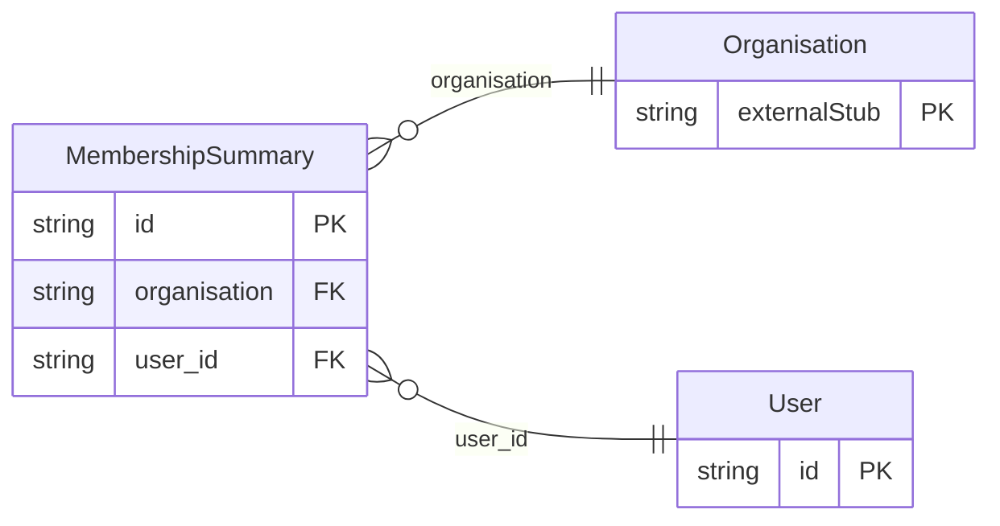

<!-- Code generated by protoc-gen-orm. DO NOT EDIT. -->

# `freebusy/identity/identity/` — Prisma schema

Generated from Protobuf by protoc-gen-orm. Source of truth is the `.proto` files — regenerate rather than editing.

| Models | Enums |
| ---: | ---: |
| 2 | 0 |

## Entity relationships

Schema file: [`identity.postgres.prisma`](./identity.postgres.prisma)

### `User` → `users`

A signed-in person. Identity is deliberately thin: actual login is an OIDC redirect flow handled over plain HTTP by the IdP, so most of "auth" never appears as an RPC. Email and identity come from the IdP and are read-only here; only profile preferences are editable.

| Column | Type | Null |
| --- | --- | --- |
| `id` | `CHAR(26)` | not null |
| `name` | `VARCHAR(255)` | not null |
| `email` | `VARCHAR(255)` | nullable |
| `display_name` | `VARCHAR(255)` | nullable |
| `avatar_url` | `VARCHAR(255)` | nullable |
| `locale` | `VARCHAR(255)` | nullable |
| `time_zone` | `VARCHAR(255)` | nullable |
| `create_time` | `TIMESTAMPTZ` | not null |
| `update_time` | `TIMESTAMPTZ` | not null |
| `etag` | `VARCHAR(255)` | nullable |

### `MembershipSummary` → `membership_summaries`

A compact view of an organisation the user belongs to.

| Column | Type | Null |
| --- | --- | --- |
| `id` | `CHAR(26)` | not null |
| `organisation` | `CHAR(26)` | nullable |
| `org_display_name` | `VARCHAR(255)` | nullable |
| `role` | `VARCHAR(255)` | nullable |
| `user_id` | `CHAR(26)` | not null |
