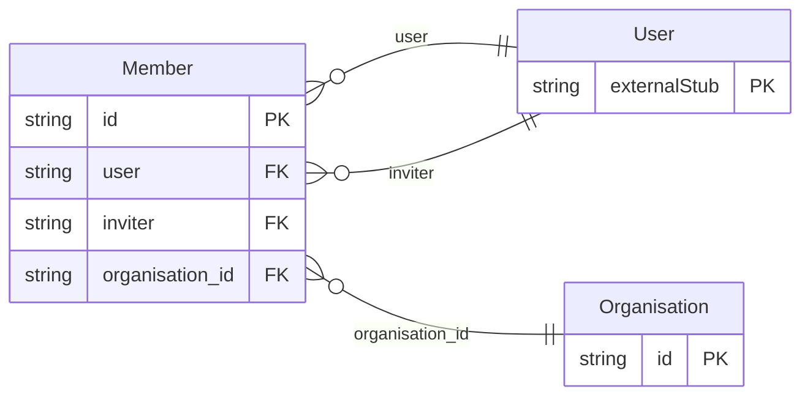

<!-- Code generated by protoc-gen-protorm. DO NOT EDIT. -->

# `freebusy/organisation/organisation/` — Prisma schema

Generated from Protobuf by protoc-gen-protorm. Source of truth is the `.proto` files — regenerate rather than editing.

| Models | Enums |
| ---: | ---: |
| 2 | 0 |

## Entity relationships

Schema file: [`organisation.postgres.prisma`](./organisation.postgres.prisma)

### `Organisation` → `organisations`

A tenant. Organisation is the unit of multi-tenancy; the shell enforces isolation with row-level security keyed off the caller's organisation, so most resource names stay flat and the organisation appears explicitly only here.

| Column | Type | Null |
| --- | --- | --- |
| `id` | `CHAR(26)` | not null |
| `name` | `VARCHAR(255)` | not null |
| `display_name` | `VARCHAR(255)` | not null |
| `slug` | `VARCHAR(255)` | nullable |
| `billing_email` | `VARCHAR(255)` | nullable |
| `state` | `OrganisationState` | nullable |
| `settings` | `JSONB` | nullable |
| `member_count` | `BIGINT` | nullable |
| `create_time` | `TIMESTAMPTZ` | not null |
| `update_time` | `TIMESTAMPTZ` | not null |
| `etag` | `VARCHAR(255)` | nullable |

### `Member` → `members`

The membership of a user in an organisation, with their role.

| Column | Type | Null |
| --- | --- | --- |
| `id` | `CHAR(26)` | not null |
| `name` | `VARCHAR(255)` | not null |
| `user` | `CHAR(26)` | nullable |
| `email` | `VARCHAR(255)` | not null |
| `display_name` | `VARCHAR(255)` | nullable |
| `role` | `OrganisationRole` | not null |
| `state` | `MemberState` | nullable |
| `inviter` | `CHAR(26)` | nullable |
| `create_time` | `TIMESTAMPTZ` | not null |
| `update_time` | `TIMESTAMPTZ` | not null |
| `etag` | `VARCHAR(255)` | nullable |
| `organisation_id` | `CHAR(26)` | not null |
