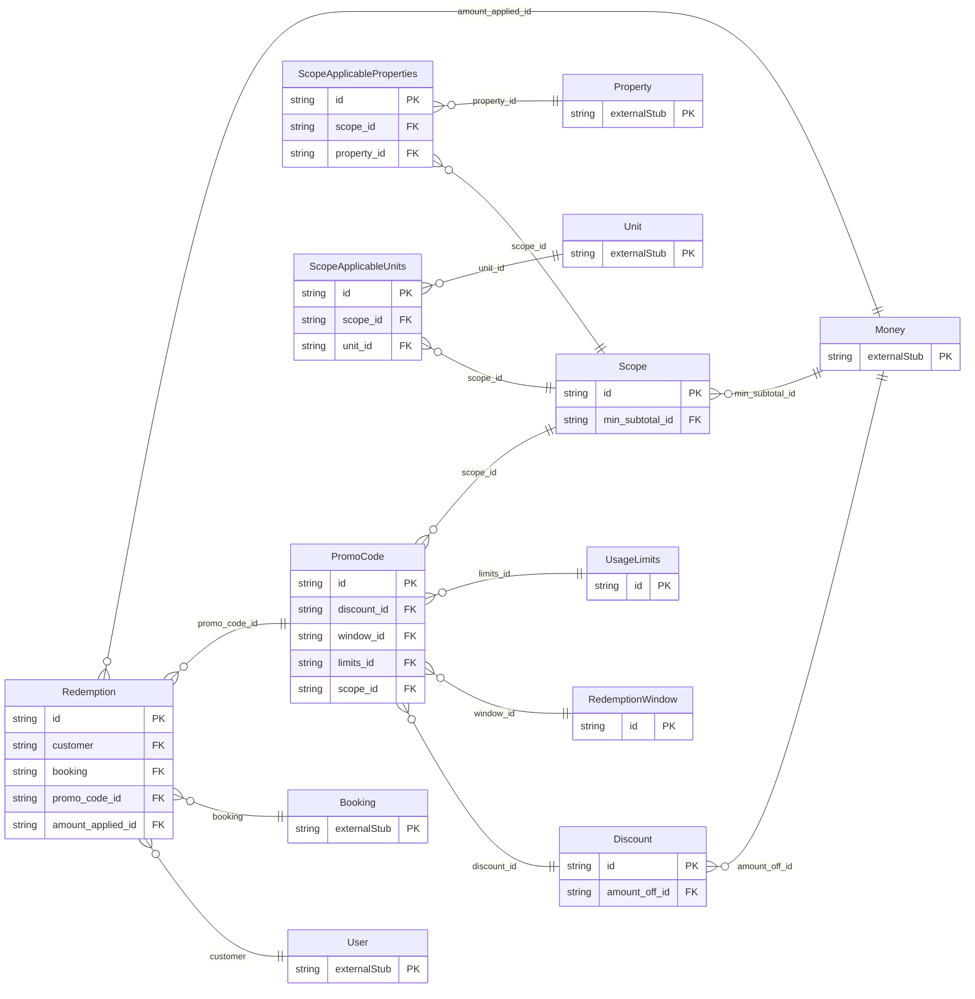

<!-- Code generated by protoc-gen-orm. DO NOT EDIT. -->

# `freebusy/promocode/promocode/` — Prisma schema

Generated from Protobuf by protoc-gen-orm. Source of truth is the `.proto` files — regenerate rather than editing.

| Models | Enums |
| ---: | ---: |
| 8 | 1 |

## Entity relationships

Schema file: [`promocode.postgres.prisma`](./promocode.postgres.prisma)

### `PromoCode` → `resource`

A redeemable discount applied to a booking's subtotal. Scoped by a redemption window, usage caps, a minimum subtotal, and an optional set of properties / units it applies to.

| Column | Type | Null |
| --- | --- | --- |
| `id` | `CHAR(26)` | not null |
| `name` | `VARCHAR(255)` | not null |
| `code` | `VARCHAR(255)` | not null |
| `display_name` | `VARCHAR(255)` | nullable |
| `description` | `TEXT` | nullable |
| `redemption_count` | `BIGINT` | nullable |
| `state` | `PromoCodeState` | nullable |
| `disabled` | `BOOLEAN` | nullable |
| `create_time` | `TIMESTAMPTZ` | not null |
| `update_time` | `TIMESTAMPTZ` | not null |
| `etag` | `VARCHAR(255)` | nullable |
| `discount_id` | `CHAR(26)` | not null |
| `window_id` | `CHAR(26)` | nullable |
| `limits_id` | `CHAR(26)` | nullable |
| `scope_id` | `CHAR(26)` | nullable |

### `Redemption` → `redemptions`

Redemption is a single use of a promo code, modeled as a sub-resource of PromoCode rather than an inline list — so it has its own name/lifecycle and is listed with paging (ListRedemptions). The {promo_code} parent segment generates the promo_code_id FK back to the owning code (1:n into promocode.redemptions); amount_applied is the shared google.type.Money in common.moneys. Redemptions are created during CreateBooking, never directly.

| Column | Type | Null |
| --- | --- | --- |
| `id` | `CHAR(26)` | not null |
| `name` | `VARCHAR(255)` | not null |
| `customer` | `CHAR(26)` | not null |
| `booking` | `CHAR(26)` | not null |
| `redeemed_time` | `TIMESTAMPTZ` | nullable |
| `promo_code_id` | `CHAR(26)` | not null |
| `amount_applied_id` | `CHAR(26)` | nullable |

### `Discount` → `discounts`

Discount describes how a promo code reduces a subtotal. Nested value object → belongs-to child table promocode.discounts (FK discount_id on promo_codes). Exactly one of percent_off / amount_off is set; the oneof case is the discriminator, so no separate type enum is needed.

| Column | Type | Null |
| --- | --- | --- |
| `id` | `CHAR(26)` | not null |
| `percent_off` | `INTEGER` | nullable |
| `amount_case` | `DiscountAmountCase` | nullable |
| `amount_off_id` | `CHAR(26)` | nullable |

### `RedemptionWindow` → `redemption_windows`

RedemptionWindow bounds when a code can be redeemed; an unset bound is open-ended. Nested value object → belongs-to promocode.redemption_windows.

| Column | Type | Null |
| --- | --- | --- |
| `id` | `CHAR(26)` | not null |
| `start_time` | `TIMESTAMPTZ` | nullable |
| `end_time` | `TIMESTAMPTZ` | nullable |

### `UsageLimits` → `usage_limits`

UsageLimits caps how often a code can be redeemed. Nested value object → belongs-to promocode.usage_limits. The caps are wrapper types so "unset" (unlimited) is distinct from an explicit value, including 0.

| Column | Type | Null |
| --- | --- | --- |
| `id` | `CHAR(26)` | not null |
| `max_redemptions` | `BIGINT` | nullable |
| `per_customer_limit` | `INTEGER` | nullable |

### `Scope` → `scopes`

Scope restricts which bookings a code applies to. Nested value object → belongs-to promocode.scopes. Its repeated resource references and Money normalize one level deeper (array columns / common.moneys).

| Column | Type | Null |
| --- | --- | --- |
| `id` | `CHAR(26)` | not null |
| `min_subtotal_id` | `CHAR(26)` | nullable |

### `ScopeApplicableProperties` → `scope_applicable_properties`

Join table for the many-to-many relation Scope.applicable_properties ↔ Property.

| Column | Type | Null |
| --- | --- | --- |
| `id` | `CHAR(26)` | not null |
| `scope_id` | `CHAR(26)` | not null |
| `property_id` | `CHAR(26)` | not null |

### `ScopeApplicableUnits` → `scope_applicable_units`

Join table for the many-to-many relation Scope.applicable_units ↔ Unit.

| Column | Type | Null |
| --- | --- | --- |
| `id` | `CHAR(26)` | not null |
| `scope_id` | `CHAR(26)` | not null |
| `unit_id` | `CHAR(26)` | not null |
| `unit_name` | `TEXT` | not null |

### Enums

- `DiscountAmountCase`: PERCENT_OFF, AMOUNT_OFF
