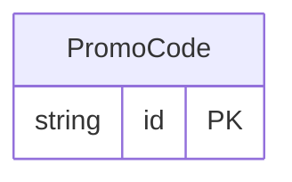

<!-- Code generated by protoc-gen-protorm. DO NOT EDIT. -->

# `freebusy/promocode/promocode/` — Prisma schema

Generated from Protobuf by protoc-gen-protorm. Source of truth is the `.proto` files — regenerate rather than editing.

| Models | Enums |
| ---: | ---: |
| 1 | 2 |

## Entity relationships

Schema file: [`promocode.postgres.prisma`](./promocode.postgres.prisma)

### `PromoCode` → `promo_codes`

A redeemable discount applied to a booking's subtotal. Scoped by a redemption window, usage caps, a minimum subtotal, and an optional set of resources / offerings it applies to.

| Column | Type | Null |
| --- | --- | --- |
| `id` | `CHAR(26)` | not null |
| `name` | `VARCHAR(255)` | not null |
| `code` | `VARCHAR(255)` | not null |
| `display_name` | `VARCHAR(255)` | nullable |
| `description` | `VARCHAR(255)` | nullable |
| `discount_type` | `DiscountType` | not null |
| `percent_off` | `INTEGER` | nullable |
| `amount_off` | `JSONB` | nullable |
| `redeem_start_time` | `TIMESTAMPTZ` | nullable |
| `redeem_end_time` | `TIMESTAMPTZ` | nullable |
| `max_redemptions` | `BIGINT` | nullable |
| `per_customer_limit` | `INTEGER` | nullable |
| `min_subtotal` | `JSONB` | nullable |
| `applicable_resources` | `VARCHAR(255)[]` | nullable |
| `applicable_offerings` | `VARCHAR(255)[]` | nullable |
| `redemption_count` | `BIGINT` | nullable |
| `state` | `PromocodeState` | nullable |
| `disabled` | `BOOLEAN` | nullable |
| `create_time` | `TIMESTAMPTZ` | not null |
| `update_time` | `TIMESTAMPTZ` | not null |
| `etag` | `VARCHAR(255)` | nullable |

### Enums

- `DiscountType`: PERCENTAGE, FIXED_AMOUNT
- `PromocodeState`: ACTIVE, DISABLED, EXPIRED
