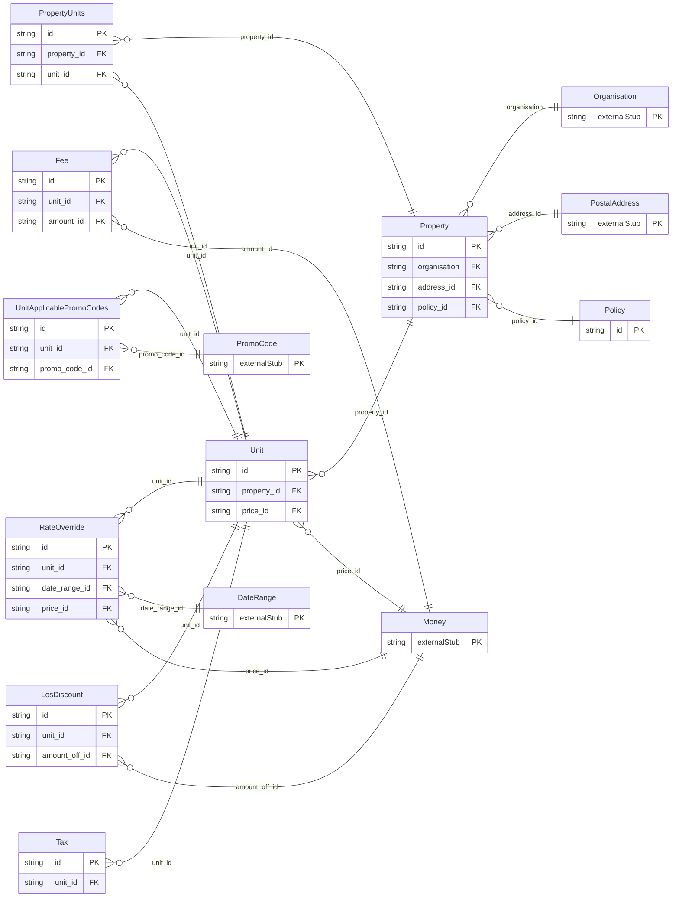

<!-- Code generated by protoc-gen-orm. DO NOT EDIT. -->

# `freebusy/property/property/` — Prisma schema

Generated from Protobuf by protoc-gen-orm. Source of truth is the `.proto` files — regenerate rather than editing.

| Models | Enums |
| ---: | ---: |
| 9 | 0 |

## Entity relationships

Schema file: [`property.postgres.prisma`](./property.postgres.prisma)

### `Property` → `properties`

A hotel (or other lodging property): the guest-facing venue a chain operates. A Property belongs to an Organisation (the chain/brand) and carries the showcase media, address, and informational policies shown to guests. Its bookable inventory lives in child Units (room types); pricing and availability are modeled there, not here.

| Column | Type | Null |
| --- | --- | --- |
| `id` | `CHAR(26)` | not null |
| `name` | `VARCHAR(255)` | not null |
| `organisation` | `CHAR(26)` | not null |
| `display_name` | `VARCHAR(255)` | not null |
| `description` | `VARCHAR(255)` | nullable |
| `time_zone` | `VARCHAR(255)` | not null |
| `tags` | `VARCHAR(255)[]` | nullable |
| `attributes` | `JSONB` | nullable |
| `state` | `PropertyState` | nullable |
| `create_time` | `TIMESTAMPTZ` | not null |
| `update_time` | `TIMESTAMPTZ` | not null |
| `etag` | `VARCHAR(255)` | nullable |
| `address_id` | `CHAR(26)` | nullable |
| `policy_id` | `CHAR(26)` | nullable |

### `Unit` → `units`

A bookable unit type within a property: a pool of `capacity` interchangeable rooms/units of the same kind (e.g. "Deluxe King", capacity 12). A Unit carries its own pricing, media, occupancy limit, and the promo codes advertised for it. The freebusy engine computes how many units are free for a window; its booking_mode decides whether availability is time slots or per-night counts.

| Column | Type | Null |
| --- | --- | --- |
| `id` | `CHAR(26)` | not null |
| `name` | `VARCHAR(255)` | not null |
| `display_name` | `VARCHAR(255)` | not null |
| `description` | `VARCHAR(255)` | nullable |
| `type` | `UnitType` | not null |
| `booking_mode` | `BookingMode` | not null |
| `capacity` | `INTEGER` | nullable |
| `max_occupancy` | `INTEGER` | nullable |
| `time_zone` | `VARCHAR(255)` | not null |
| `pricing_unit` | `PricingUnit` | nullable |
| `duration` | `INTERVAL` | nullable |
| `tags` | `VARCHAR(255)[]` | nullable |
| `attributes` | `JSONB` | nullable |
| `state` | `UnitState` | nullable |
| `create_time` | `TIMESTAMPTZ` | not null |
| `update_time` | `TIMESTAMPTZ` | not null |
| `etag` | `VARCHAR(255)` | nullable |
| `property_id` | `CHAR(26)` | not null |
| `price_id` | `CHAR(26)` | nullable |

### `Policy` → `policies`

Guest-facing, informational property policy: what to *display* to a guest (check-in/out hours, house rules). The enforced refund/stay rules that gate bookability live on each Unit's Schedule (freebusy.schedule.v1), not here, so there is a single source of truth for enforcement.

| Column | Type | Null |
| --- | --- | --- |
| `id` | `CHAR(26)` | not null |
| `checkin_time` | `TIME` | nullable |
| `checkout_time` | `TIME` | nullable |
| `house_rules` | `VARCHAR(255)[]` | nullable |
| `notes` | `VARCHAR(255)` | nullable |

### `RateOverride` → `rate_overrides`

A price override for a span of dates and/or specific weekdays, layered over a unit's base `price`. The price is still interpreted per the unit's pricing_unit (per night, per booking, per person).

| Column | Type | Null |
| --- | --- | --- |
| `id` | `CHAR(26)` | not null |
| `weekdays` | `` | nullable |
| `unit_id` | `CHAR(26)` | not null |
| `date_range_id` | `CHAR(26)` | nullable |
| `price_id` | `CHAR(26)` | not null |

### `LosDiscount` → `los_discounts`

A discount applied to a NIGHTLY subtotal once the stay reaches a minimum length. Exactly one of percent_off or amount_off is set.

| Column | Type | Null |
| --- | --- | --- |
| `id` | `CHAR(26)` | not null |
| `min_nights` | `INTEGER` | not null |
| `percent_off` | `INTEGER` | nullable |
| `unit_id` | `CHAR(26)` | not null |
| `amount_off_id` | `CHAR(26)` | nullable |

### `Fee` → `fees`

A fee added on top of a unit's base subtotal. Exactly one of `amount` or `percent` is set. Surfaces as a TYPE_FEE line in a booking's price_components.

| Column | Type | Null |
| --- | --- | --- |
| `id` | `CHAR(26)` | not null |
| `code` | `VARCHAR(255)` | not null |
| `display_name` | `VARCHAR(255)` | nullable |
| `percent` | `INTEGER` | nullable |
| `pricing_unit` | `PricingUnit` | nullable |
| `taxable` | `BOOLEAN` | nullable |
| `unit_id` | `CHAR(26)` | not null |
| `amount_id` | `CHAR(26)` | nullable |

### `Tax` → `taxes`

A tax applied to the taxable base (base subtotal plus taxable fees). Surfaces as a TYPE_TAX line in a booking's price_components.

| Column | Type | Null |
| --- | --- | --- |
| `id` | `CHAR(26)` | not null |
| `code` | `VARCHAR(255)` | not null |
| `display_name` | `VARCHAR(255)` | nullable |
| `percent` | `DOUBLE PRECISION` | not null |
| `unit_id` | `CHAR(26)` | not null |

### `PropertyUnits` → `units_link`

Join table for the many-to-many relation Property.units ↔ Unit.

| Column | Type | Null |
| --- | --- | --- |
| `id` | `CHAR(26)` | not null |
| `property_id` | `CHAR(26)` | not null |
| `unit_id` | `CHAR(26)` | not null |
| `unit_name` | `TEXT` | not null |

### `UnitApplicablePromoCodes` → `unit_applicable_promo_codes`

Join table for the many-to-many relation Unit.applicable_promo_codes ↔ PromoCode.

| Column | Type | Null |
| --- | --- | --- |
| `id` | `CHAR(26)` | not null |
| `unit_id` | `CHAR(26)` | not null |
| `promo_code_id` | `CHAR(26)` | not null |
