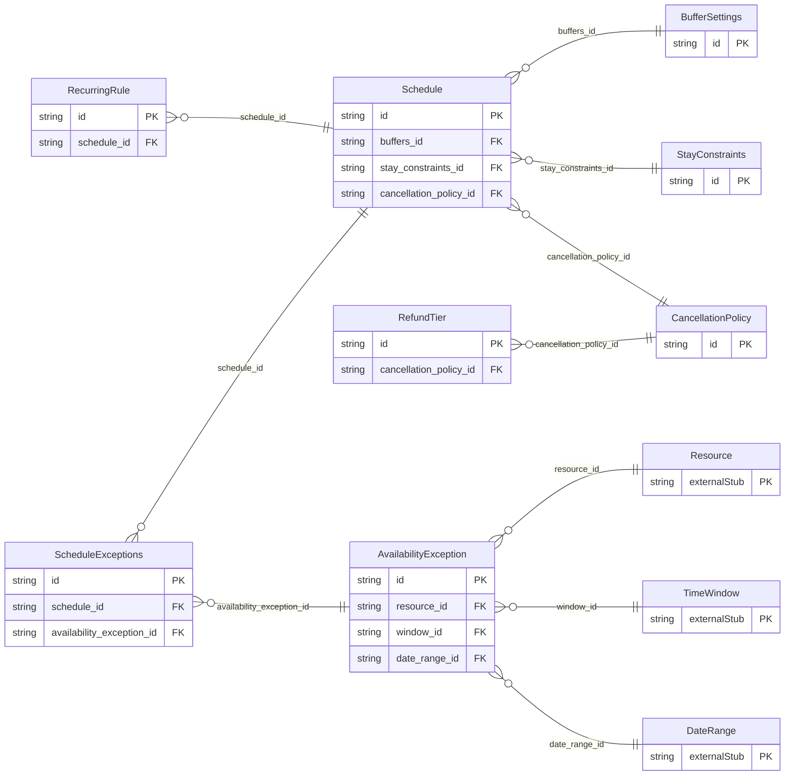

<!-- Code generated by protoc-gen-protorm. DO NOT EDIT. -->

# `freebusy/schedule/schedule/` — Prisma schema

Generated from Protobuf by protoc-gen-protorm. Source of truth is the `.proto` files — regenerate rather than editing.

| Models | Enums |
| ---: | ---: |
| 8 | 2 |

## Entity relationships

Schema file: [`schedule.postgres.prisma`](./schedule.postgres.prisma)

### `AvailabilityException` → `availability_exceptions`

An override of a resource's normal hours on a specific span: a blackout / holiday closure, or extra hours beyond the recurring rules.

| Column | Type | Null |
| --- | --- | --- |
| `id` | `CHAR(26)` | not null |
| `name` | `VARCHAR(255)` | not null |
| `kind` | `ExceptionKind` | not null |
| `reason` | `VARCHAR(255)` | nullable |
| `create_time` | `TIMESTAMPTZ` | not null |
| `span_case` | `AvailabilityExceptionSpanCase` | nullable |
| `resource_id` | `CHAR(26)` | not null |
| `window_id` | `CHAR(26)` | nullable |
| `date_range_id` | `CHAR(26)` | nullable |

### `Schedule` → `resource`

Aggregate read view of a resource's availability configuration: the inputs the freebusy engine consumes. Modeled as a singleton resource, one per resource.

| Column | Type | Null |
| --- | --- | --- |
| `id` | `CHAR(26)` | not null |
| `name` | `VARCHAR(255)` | not null |
| `etag` | `VARCHAR(255)` | nullable |
| `buffers_id` | `CHAR(26)` | nullable |
| `stay_constraints_id` | `CHAR(26)` | nullable |
| `cancellation_policy_id` | `CHAR(26)` | nullable |

### `RecurringRule` → `recurring_rules`

A recurring availability window expressed as an RRULE plus a daily open span. The freebusy engine expands these against the resource's timezone.

| Column | Type | Null |
| --- | --- | --- |
| `id` | `CHAR(26)` | not null |
| `rrule` | `VARCHAR(255)` | not null |
| `opens` | `VARCHAR(255)` | nullable |
| `closes` | `VARCHAR(255)` | nullable |
| `schedule_id` | `CHAR(26)` | not null |

### `BufferSettings` → `buffer_settings`

Buffer and notice settings applied around bookings.

| Column | Type | Null |
| --- | --- | --- |
| `id` | `CHAR(26)` | not null |
| `start_delta` | `INTERVAL` | nullable |
| `end_delta` | `INTERVAL` | nullable |
| `min_notice` | `INTERVAL` | nullable |
| `max_advance` | `INTERVAL` | nullable |
| `gap` | `INTERVAL` | nullable |

### `StayConstraints` → `stay_constraints`

Stay rules that affect bookability for NIGHTLY resources.

| Column | Type | Null |
| --- | --- | --- |
| `id` | `CHAR(26)` | not null |
| `min_nights` | `INTEGER` | nullable |
| `max_nights` | `INTEGER` | nullable |
| `checkin_weekdays` | `[]` | nullable |
| `checkout_weekdays` | `[]` | nullable |
| `advance_min_days` | `INTEGER` | nullable |
| `advance_max_days` | `INTEGER` | nullable |

### `CancellationPolicy` → `cancellation_policies`

Refund rules graded by how far ahead of a booking's start it is cancelled.

| Column | Type | Null |
| --- | --- | --- |
| `id` | `CHAR(26)` | not null |

### `RefundTier` → `refund_tiers`

One tier of a CancellationPolicy: cancel at least `cutoff` before the booking start to receive `refund_percent` of the total back.

| Column | Type | Null |
| --- | --- | --- |
| `id` | `CHAR(26)` | not null |
| `cutoff` | `INTERVAL` | not null |
| `refund_percent` | `INTEGER` | not null |
| `cancellation_policy_id` | `CHAR(26)` | not null |

### `ScheduleExceptions` → `exceptions`

Join table for the many-to-many relation Schedule.exceptions ↔ AvailabilityException.

| Column | Type | Null |
| --- | --- | --- |
| `id` | `CHAR(26)` | not null |
| `schedule_id` | `CHAR(26)` | not null |
| `availability_exception_id` | `CHAR(26)` | not null |

### Enums

- `ExceptionKind`: CLOSURE, EXTRA_HOURS
- `AvailabilityExceptionSpanCase`: WINDOW, DATE_RANGE
