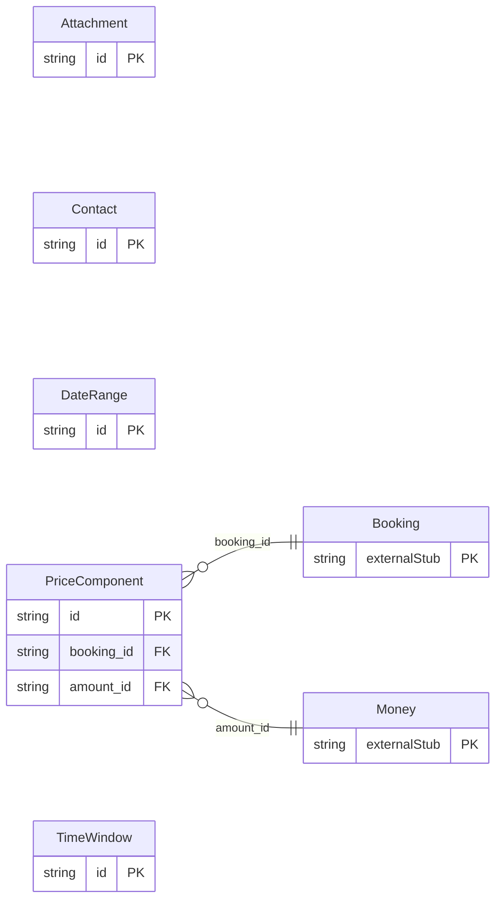

<!-- Code generated by protoc-gen-orm. DO NOT EDIT. -->

# `freebusy/shared/` — Prisma schema

Generated from Protobuf by protoc-gen-orm. Source of truth is the `.proto` files — regenerate rather than editing.

| Models | Enums |
| ---: | ---: |
| 5 | 3 |

## Entity relationships

## Subfolders

- [`enums/`](./enums/README.md)
- [`types/`](./types/README.md)
