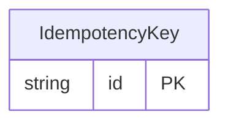

<!-- Code generated by protoc-gen-orm. DO NOT EDIT. -->

# `freebusy/shared/idempotency/` — Prisma schema

Generated from Protobuf by protoc-gen-orm. Source of truth is the `.proto` files — regenerate rather than editing.

| Models | Enums |
| ---: | ---: |
| 1 | 1 |

## Entity relationships

Schema file: [`idempotency.postgres.prisma`](./idempotency.postgres.prisma)

### `IdempotencyKey` → `idempotency_keys`

The record behind every `request_id` field in this API: it remembers what the first call with a given id returned, so a retry replays that response instead of attempting the write twice. Storage only — no service exposes it, and no caller constructs one. It lives in freebusy.shared.v1 because request_id is API-wide (booking, property, promo code, channel, organisation, schedule) and one interceptor records them all; homing it in any single service's package would make every other service import that service to dedupe its own writes. The id is derived, not random: it is a digest of (method, request_id), so the primary key itself is the uniqueness constraint that makes a concurrent duplicate lose the race rather than double-write.

| Column | Type | Null |
| --- | --- | --- |
| `id` | `CHAR(26)` | not null |
| `name` | `VARCHAR(255)` | not null |
| `method` | `VARCHAR(255)` | not null |
| `request_id` | `VARCHAR(255)` | not null |
| `state` | `IdempotencyState` | not null |
| `response` | `TEXT` | nullable |
| `create_time` | `TIMESTAMPTZ` | not null |
| `update_time` | `TIMESTAMPTZ` | not null |

### Enums

- `IdempotencyState`: IN_FLIGHT, DONE
