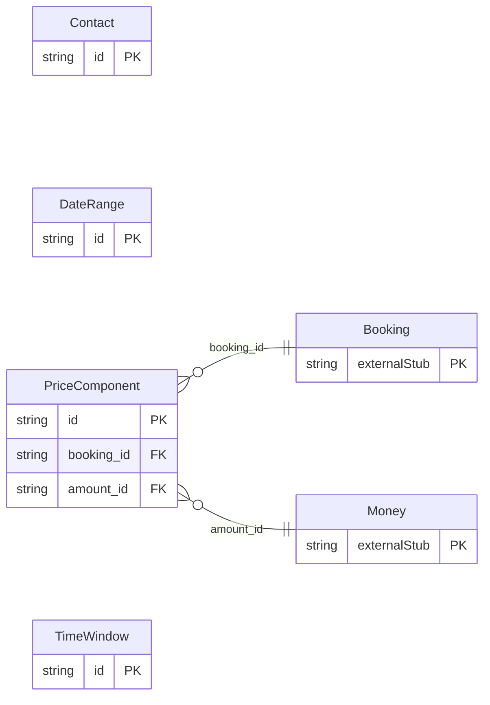

<!-- Code generated by protoc-gen-protorm. DO NOT EDIT. -->

# `freebusy/shared/types/` — Prisma schema

Generated from Protobuf by protoc-gen-protorm. Source of truth is the `.proto` files — regenerate rather than editing.

| Models | Enums |
| ---: | ---: |
| 4 | 1 |

## Entity relationships

Schema file: [`types.postgres.prisma`](./types.postgres.prisma)

### `Contact` → `contacts`

Contact details for the person a booking is for. When a booking carries a `customer` (a users/{user} reference) these typically mirror the user's profile; for walk-in or email-only bookings made by someone who is not a registered user, this is the only contact information captured. The server requires at least one reachable channel (email or phone) when no customer is set.

| Column | Type | Null |
| --- | --- | --- |
| `id` | `CHAR(26)` | not null |
| `display_name` | `VARCHAR(255)` | nullable |
| `email` | `VARCHAR(255)` | nullable |
| `phone_number` | `VARCHAR(255)` | nullable |

### `TimeWindow` → `time_windows`

A half-open time interval [start_time, end_time). Used for query windows and for a booking's reserved span in both TIME_SLOT and NIGHTLY modes.

| Column | Type | Null |
| --- | --- | --- |
| `id` | `CHAR(26)` | not null |
| `start_time` | `TIMESTAMPTZ` | not null |
| `end_time` | `TIMESTAMPTZ` | not null |

### `PriceComponent` → `price_components`

One line in a price breakdown: a base charge, a fee, a tax, or a discount. Clients branch on `type` and `code`; the signed `amount` rolls up to the booking total (charges positive, discounts negative).

| Column | Type | Null |
| --- | --- | --- |
| `id` | `CHAR(26)` | not null |
| `type` | `Type` | nullable |
| `code` | `VARCHAR(255)` | nullable |
| `display_name` | `VARCHAR(255)` | nullable |
| `booking_id` | `CHAR(26)` | not null |
| `amount_id` | `CHAR(26)` | nullable |

### `DateRange` → `date_ranges`

A half-open range of calendar dates [start_date, end_date), evaluated in the resource's local timezone. The natural query and exception shape for NIGHTLY resources: end_date is the check-out date and is not itself included.

| Column | Type | Null |
| --- | --- | --- |
| `id` | `CHAR(26)` | not null |
| `start_date` | `DATE` | not null |
| `end_date` | `DATE` | not null |

### Enums

- `Type`: BASE, FEE, TAX, DISCOUNT
