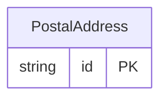

<!-- Code generated by protoc-gen-orm. DO NOT EDIT. -->

# `freebusy/type/postal_address/` — Prisma schema

Generated from Protobuf by protoc-gen-orm. Source of truth is the `.proto` files — regenerate rather than editing.

| Models | Enums |
| ---: | ---: |
| 1 | 0 |

## Entity relationships

Schema file: [`postal_address.postgres.prisma`](./postal_address.postgres.prisma)

### `PostalAddress` → `postal_address`

Represents a postal address, such as for postal delivery or payments addresses. With a postal address, a postal service can deliver items to a premise, P.O. box, or similar. A postal address is not intended to model geographical locations like roads, towns, or mountains. In typical usage, an address would be created by user input or from importing existing data, depending on the type of process. Advice on address input or editing: - Use an internationalization-ready address widget such as https://github.com/google/libaddressinput. - Users should not be presented with UI elements for input or editing of fields outside countries where that field is used. For more guidance on how to use this schema, see: https://support.google.com/business/answer/6397478.

| Column | Type | Null |
| --- | --- | --- |
| `id` | `CHAR(26)` | not null |
| `revision` | `INTEGER` | nullable |
| `region_code` | `VARCHAR(255)` | nullable |
| `language_code` | `VARCHAR(255)` | nullable |
| `postal_code` | `VARCHAR(255)` | nullable |
| `sorting_code` | `VARCHAR(255)` | nullable |
| `administrative_area` | `VARCHAR(255)` | nullable |
| `locality` | `VARCHAR(255)` | nullable |
| `sublocality` | `VARCHAR(255)` | nullable |
| `address_lines` | `VARCHAR(255)[]` | nullable |
| `recipients` | `VARCHAR(255)[]` | nullable |
| `organization` | `VARCHAR(255)` | nullable |
