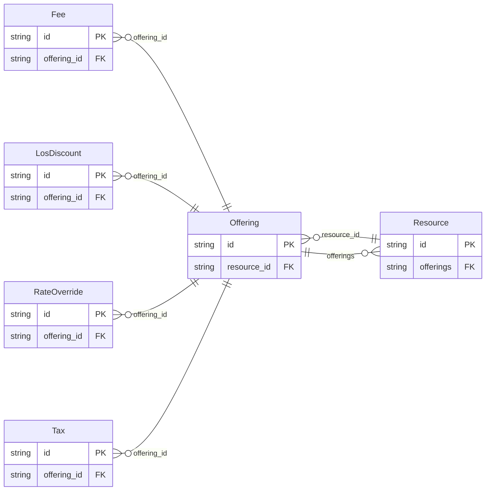

<!-- Code generated by protoc-gen-protorm. DO NOT EDIT. -->

# `v1/resource/` — Prisma schema

Generated from Protobuf by protoc-gen-protorm. Source of truth is the `.proto` files — regenerate rather than editing.

| Models | Enums |
| ---: | ---: |
| 6 | 3 |

## Entity relationships

## Subfolders

- [`resource/`](./resource/README.md)
