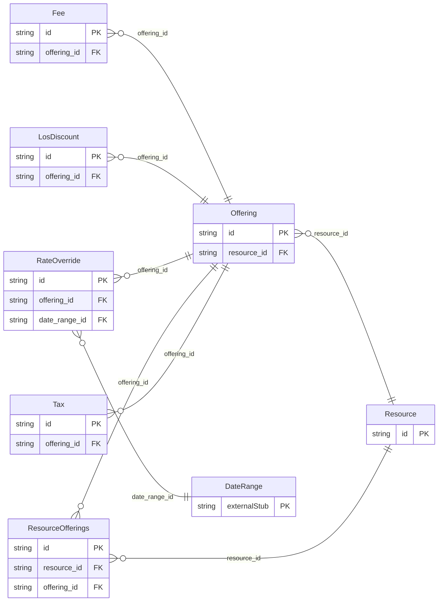

<!-- Code generated by protoc-gen-protorm. DO NOT EDIT. -->

# `v1/resource/resource/` — Prisma schema

Generated from Protobuf by protoc-gen-protorm. Source of truth is the `.proto` files — regenerate rather than editing.

| Models | Enums |
| ---: | ---: |
| 7 | 2 |

## Entity relationships

Schema file: [`resource.postgres.prisma`](./resource.postgres.prisma)

### `Resource` → `resources`

A bookable thing: a provider, room, piece of equipment, or a unit type. A resource is a pool of `capacity` interchangeable units; the freebusy engine computes how many are free for a given window. Its booking_mode decides whether availability is produced as time slots or per-night counts.

| Column | Type | Null |
| --- | --- | --- |
| `id` | `CHAR(26)` | not null |
| `name` | `VARCHAR(255)` | not null |
| `display_name` | `VARCHAR(255)` | not null |
| `description` | `VARCHAR(255)` | nullable |
| `type` | `ResourceType` | not null |
| `booking_mode` | `BookingMode` | not null |
| `capacity` | `INTEGER` | nullable |
| `time_zone` | `VARCHAR(255)` | not null |
| `tags` | `VARCHAR(255)[]` | nullable |
| `attributes` | `JSONB` | nullable |
| `state` | `State` | nullable |
| `create_time` | `TIMESTAMPTZ` | not null |
| `update_time` | `TIMESTAMPTZ` | not null |
| `etag` | `VARCHAR(255)` | nullable |

### `Offering` → `offerings`

A specific way a resource can be booked, carrying its duration and price. A "30-min consult" and a "60-min session" are two offerings on the same provider. For NIGHTLY resources the duration is unused and price is per-night.

| Column | Type | Null |
| --- | --- | --- |
| `id` | `CHAR(26)` | not null |
| `name` | `VARCHAR(255)` | not null |
| `display_name` | `VARCHAR(255)` | not null |
| `description` | `VARCHAR(255)` | nullable |
| `duration` | `INTERVAL` | nullable |
| `price` | `JSONB` | nullable |
| `pricing_unit` | `PricingUnit` | nullable |
| `state` | `State` | nullable |
| `create_time` | `TIMESTAMPTZ` | not null |
| `update_time` | `TIMESTAMPTZ` | not null |
| `etag` | `VARCHAR(255)` | nullable |
| `resource_id` | `CHAR(26)` | not null |

### `RateOverride` → `rate_overrides`

A price override for a span of dates and/or specific weekdays, layered over an offering's base `price`. The price is still interpreted per the offering's pricing_unit (per night, per booking, per person).

| Column | Type | Null |
| --- | --- | --- |
| `id` | `CHAR(26)` | not null |
| `weekdays` | `[]` | nullable |
| `price` | `JSONB` | not null |
| `offering_id` | `CHAR(26)` | not null |
| `date_range_id` | `CHAR(26)` | nullable |

### `LosDiscount` → `los_discounts`

A discount applied to a NIGHTLY subtotal once the stay reaches a minimum length. Exactly one of percent_off or amount_off is set.

| Column | Type | Null |
| --- | --- | --- |
| `id` | `CHAR(26)` | not null |
| `min_nights` | `INTEGER` | not null |
| `percent_off` | `INTEGER` | nullable |
| `amount_off` | `JSONB` | nullable |
| `offering_id` | `CHAR(26)` | not null |

### `Fee` → `fees`

A fee added on top of an offering's base subtotal. Exactly one of `amount` or `percent` is set. Surfaces as a TYPE_FEE line in a booking's price_components.

| Column | Type | Null |
| --- | --- | --- |
| `id` | `CHAR(26)` | not null |
| `code` | `VARCHAR(255)` | not null |
| `display_name` | `VARCHAR(255)` | nullable |
| `amount` | `JSONB` | nullable |
| `percent` | `INTEGER` | nullable |
| `pricing_unit` | `PricingUnit` | nullable |
| `taxable` | `BOOLEAN` | nullable |
| `offering_id` | `CHAR(26)` | not null |

### `Tax` → `taxes`

A tax applied to the taxable base (base subtotal plus taxable fees). Surfaces as a TYPE_TAX line in a booking's price_components.

| Column | Type | Null |
| --- | --- | --- |
| `id` | `CHAR(26)` | not null |
| `code` | `VARCHAR(255)` | not null |
| `display_name` | `VARCHAR(255)` | nullable |
| `percent` | `DOUBLE PRECISION` | not null |
| `offering_id` | `CHAR(26)` | not null |

### `ResourceOfferings` → `resource_offerings`

Join table for the many-to-many relation Resource.offerings ↔ Offering.

| Column | Type | Null |
| --- | --- | --- |
| `id` | `CHAR(26)` | not null |
| `resource_id` | `CHAR(26)` | not null |
| `offering_id` | `CHAR(26)` | not null |

### Enums

- `ResourceType`: PROVIDER, ROOM, EQUIPMENT, UNIT_TYPE, SPACE
- `PricingUnit`: PER_BOOKING, PER_NIGHT, PER_PERSON
